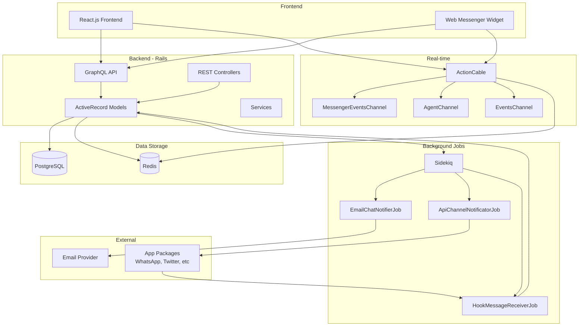
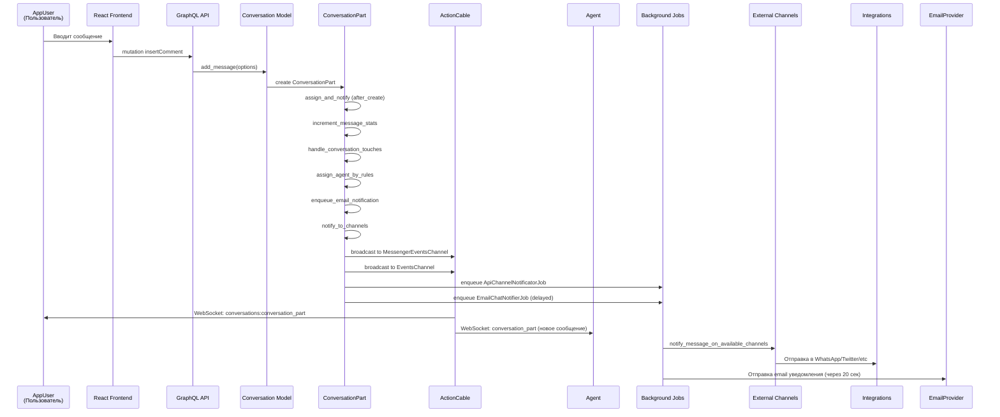
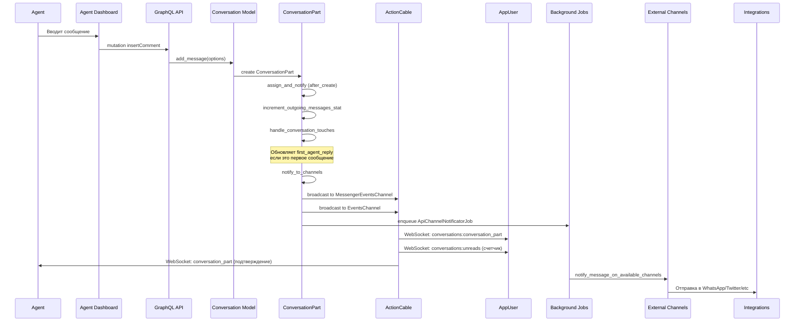
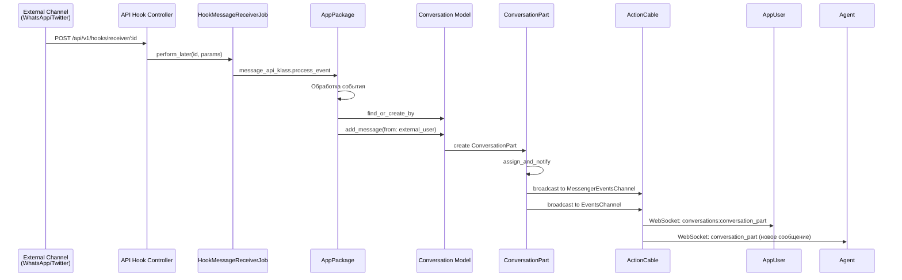
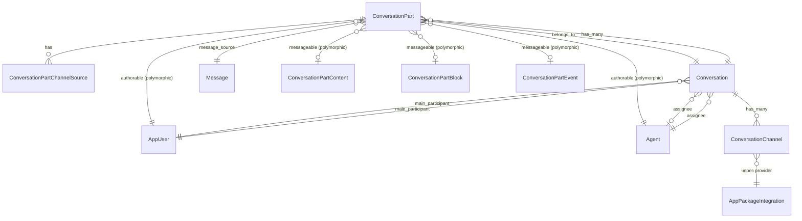

# Анализ архитектуры Chaskiq

## Обзор проекта

Chaskiq - это платформа для обмена сообщениями (messaging platform) для маркетинга, поддержки и продаж. Проект построен на Ruby on Rails с React.js фронтендом, использует PostgreSQL для хранения данных, Redis для кэширования и очередей, и ActionCable для WebSocket соединений.

## Ключевые понятия

### Основные сущности

#### App (Приложение)
- Основная сущность, представляющая отдельное приложение/организацию в системе
- Содержит настройки, предпочтения, интеграции
- Имеет множество пользователей, агентов, разговоров
- Метод `start_conversation` создает новый разговор

#### AppUser (Пользователь приложения)
- Представляет клиента/пользователя, который общается через мессенджер
- Может быть трех типов: `Visitor`, `Lead`, `AppUser`
- Имеет свойства (properties), метрики, визиты
- Связан с разговорами через `main_participant`
- Использует Redis для счетчиков новых сообщений

#### Agent (Агент)
- Представляет сотрудника/оператора, который отвечает на сообщения
- Может быть человеком или ботом (`bot: true`)
- Имеет роли и права доступа к приложениям
- Аутентификация через Devise

#### Conversation (Разговор)
- Основная единица общения между пользователем и агентом
- Имеет состояние: `opened`, `closed`
- Связан с `main_participant` (AppUser) и `assignee` (Agent)
- Содержит множество сообщений (`ConversationPart`)
- Может иметь теги, приоритет
- Использует AASM для управления состоянием

#### ConversationPart (Сообщение)
- Отдельное сообщение в разговоре
- Может быть разных типов через полиморфную связь `messageable`:
  - `ConversationPartContent` - текстовое сообщение
  - `ConversationPartBlock` - сообщение с блоками/контролами
  - `ConversationPartEvent` - системное событие
- Имеет автора через полиморфную связь `authorable` (AppUser или Agent)
- Может быть приватной заметкой (`private_note`)
- Отслеживает статус прочтения (`read_at`)

#### Message (Базовый класс для кампаний)
- Базовый класс для различных типов сообщений: Campaign, UserAutoMessage, Tour, Banner, BotTask
- Использует STI (Single Table Inheritance) через таблицу `campaigns`
- Имеет сегменты для таргетинга пользователей

#### ConversationChannel (Канал разговора)
- Связывает разговор с внешними каналами (WhatsApp, Twitter, Slack и т.д.)
- Используется для отправки сообщений через интеграции
- Имеет `provider` (название интеграции) и `provider_channel_id`

#### AppPackage / AppPackageIntegration
- Плагины/интеграции для расширения функциональности
- Позволяют добавлять новые каналы связи и функциональность
- Имеют API для обработки входящих и исходящих сообщений

### Каналы связи (ActionCable)

#### MessengerEventsChannel
- WebSocket канал для пользователей (AppUser)
- Подписка: `messenger_events:{app_key}-{session_id}`
- Используется для отправки событий пользователям в реальном времени
- Обрабатывает события от пользователей (отправка сообщений, трекинг и т.д.)

#### AgentChannel
- WebSocket канал для агентов
- Подписка: `events:{app_key}-{agent_id}`
- Используется для уведомления агентов о новых сообщениях и событиях

#### EventsChannel
- Общий канал для приложения
- Подписка: `events:{app_key}`
- Используется для широковещательных событий в рамках приложения

### Jobs (Фоновые задачи)

#### ApiChannelNotificatorJob
- Уведомляет внешние каналы (интеграции) о новом сообщении
- Вызывается после создания `ConversationPart`
- Проходит по всем `conversation_channels` и отправляет уведомления

#### EmailChatNotifierJob
- Отправляет email уведомления о новых сообщениях
- Выполняется с задержкой 20 секунд
- Не отправляется для автоматических сообщений и приватных заметок

#### HookMessageReceiverJob
- Обрабатывает входящие сообщения от внешних интеграций
- Вызывается через API hooks

## Архитектура системы

## Поток сообщения от одного участника другому

### Сценарий 1: Пользователь отправляет сообщение агенту

### Сценарий 2: Агент отправляет сообщение пользователю

### Сценарий 3: Входящее сообщение от внешнего канала

## Детальная схема обработки сообщения

## Структура данных

### ConversationPart (сообщение)

## Ключевые компоненты обработки

### 1. Создание сообщения

**Метод:** `Conversation#add_message(options)`

**Процесс:**
1. Создает новый `ConversationPart`
2. Устанавливает автора (`authorable`)
3. Создает содержимое сообщения (`ConversationPartContent`)
4. Сохраняет в транзакции
5. Вызывает `notify_to_channels`

### 2. Уведомления через WebSocket

**Каналы:**
- `MessengerEventsChannel` - для пользователей
  - Ключ: `messenger_events:{app_key}-{session_id}`
  - События: `conversations:conversation_part`, `conversations:unreads`, `conversations:update_state`
  
- `EventsChannel` - для агентов
  - Ключ: `events:{app_key}` или `events:{app_key}-{agent_id}`
  - События: `conversation_part`, `conversations:update_state`

### 3. Интеграции с внешними каналами

**Процесс:**
1. `ConversationPart` создается
2. `ApiChannelNotificatorJob` ставится в очередь
3. Job находит все `conversation_channels` для разговора
4. Для каждого канала вызывается `notify_part`
5. `AppPackageIntegration.message_api_klass.notify_message` отправляет сообщение

### 4. Автоматическое назначение агента

**Правила назначения (Assignment Rules):**
- Проверяются после создания сообщения от пользователя
- Анализируется текст сообщения
- Если правило срабатывает, назначается соответствующий агент
- Создается событие `conversation_assigned`

### 5. Боты и триггеры

**ActionTrigger:**
- Обрабатывает ответы пользователей на сообщения ботов
- Определяет следующий шаг в диалоге
- Создает новые сообщения от бота
- Регистрирует метрики взаимодействия

## Технологический стек

- **Backend:** Ruby on Rails 7.2.1
- **Frontend:** React.js
- **API:** GraphQL (graphql-ruby)
- **WebSocket:** ActionCable (AnyCable)
- **Database:** PostgreSQL
- **Cache/Queue:** Redis
- **Background Jobs:** Sidekiq
- **Search:** Searchkick (Elasticsearch/OpenSearch)
- **Authentication:** Devise, Doorkeeper (OAuth)

## Особенности реализации

1. **Полиморфные связи:** `ConversationPart` использует полиморфные связи для `authorable` (AppUser/Agent) и `messageable` (Content/Block/Event)

2. **State Machine:** `Conversation` использует AASM для управления состоянием (opened/closed)

3. **Redis Objects:** Используется для счетчиков новых сообщений и блокировок

4. **Event Sourcing:** События разговоров логируются через `Event` модель

5. **Плагинная архитектура:** `AppPackage` позволяет расширять функциональность через интеграции

6. **Многоязычность:** Используется Globalize для переводов

7. **Аудит:** Изменения записываются через `Audit` модель

## Потенциальные точки оптимизации

1. **N+1 запросы:** При загрузке разговоров с сообщениями
2. **WebSocket broadcast:** Можно оптимизировать фильтрацию событий
3. **Background jobs:** Можно добавить приоритеты для критичных задач
4. **Кэширование:** Можно кэшировать часто запрашиваемые данные (агенты, правила назначения)

