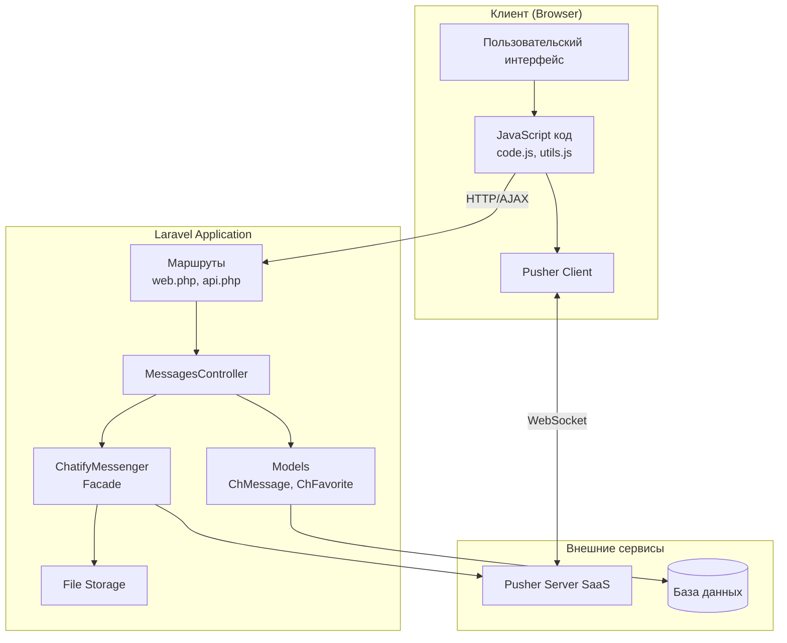
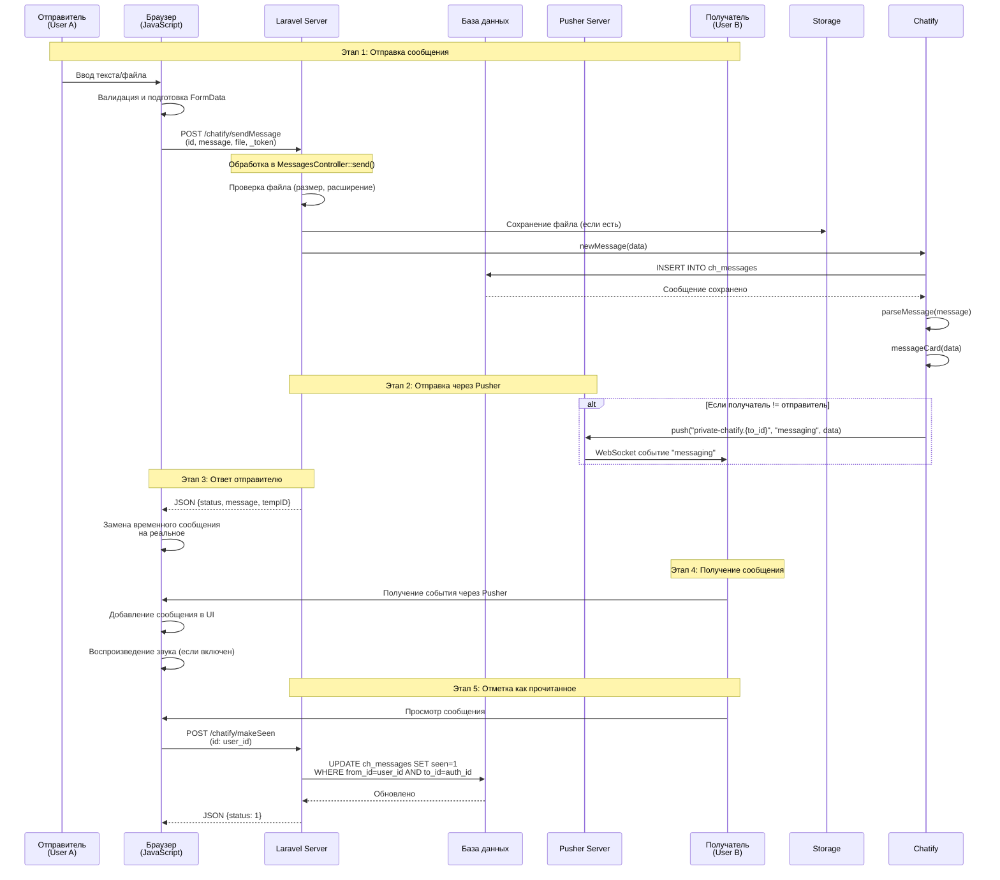
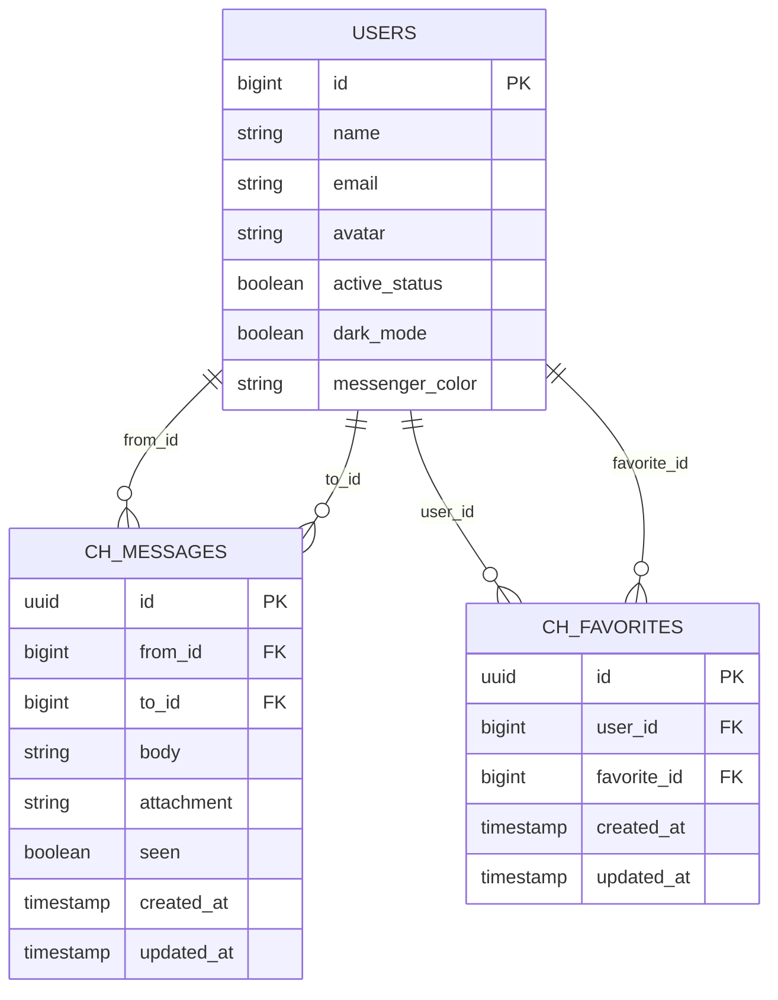
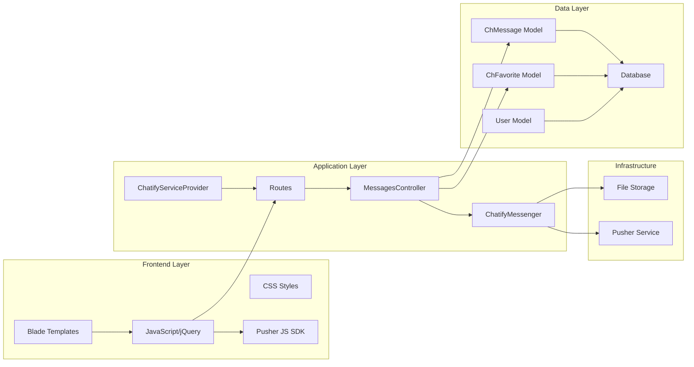
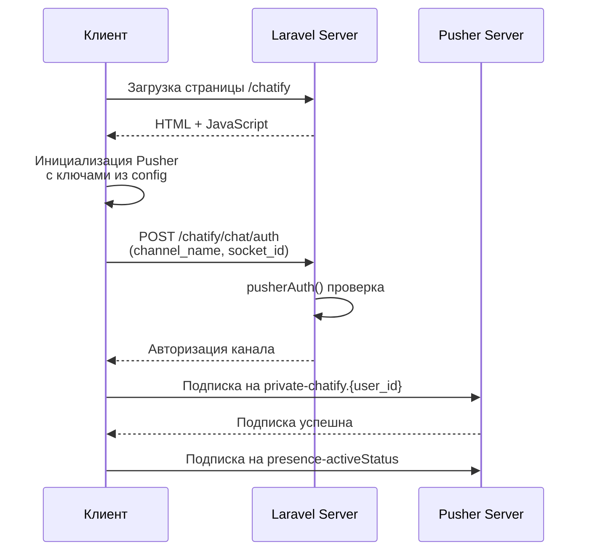
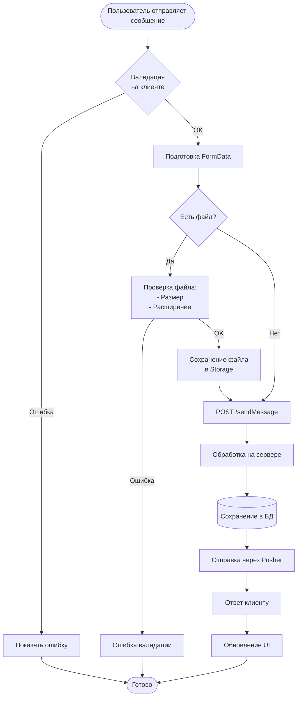
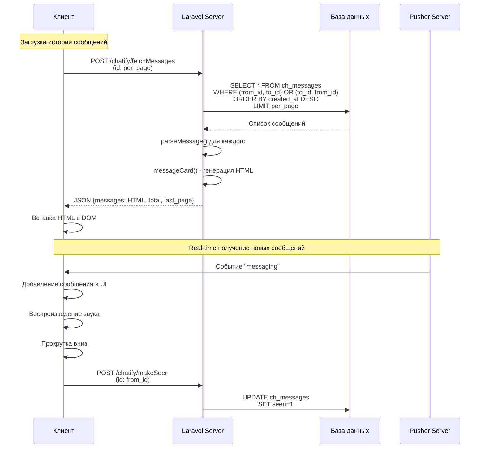

# Архитектура Chatify

## Обзор проекта

**Chatify** — это Laravel-пакет для реализации системы обмена сообщениями один-на-один в реальном времени. Пакет использует Pusher для real-time коммуникации и предоставляет полнофункциональный мессенджер с поддержкой файлов, эмодзи, статусов активности и других функций.

## Ключевые понятия

### Основные компоненты

1. **ChatifyMessenger** — главный класс-фасад, предоставляющий API для работы с сообщениями, пользователями и Pusher
2. **MessagesController** — контроллер для обработки HTTP-запросов (веб и API)
3. **ChMessage** — модель Eloquent для сообщений
4. **ChFavorite** — модель для избранных контактов
5. **Pusher** — внешний SaaS-сервис для real-time коммуникации через WebSocket

### Pusher — что это?

**Pusher** — это внешний облачный сервис (SaaS), предоставляющий инфраструктуру для real-time коммуникации через WebSocket. Это не компонент Laravel, а отдельный сервис, который требует:

1. **Регистрации** на сайте [pusher.com](https://pusher.com)
2. **Создания приложения** в панели управления Pusher
3. **Получения учетных данных**:
   - `PUSHER_APP_KEY` — публичный ключ приложения
   - `PUSHER_APP_SECRET` — секретный ключ (используется на сервере)
   - `PUSHER_APP_ID` — ID приложения
   - `PUSHER_APP_CLUSTER` — регион кластера (например, `mt1`, `eu`, `ap-southeast-1`)

4. **Настройки в `.env` файле**:
   ```env
   PUSHER_APP_KEY=your_key
   PUSHER_APP_SECRET=your_secret
   PUSHER_APP_ID=your_app_id
   PUSHER_APP_CLUSTER=mt1
   ```

**Альтернативы Pusher:**
- Можно использовать собственный WebSocket-сервер (например, Laravel Echo Server, Soketi)
- Или другие сервисы: Ably, PubNub, Firebase Realtime Database

**Почему Pusher?**
- Простая интеграция
- Масштабируемость
- Надежность
- Поддержка приватных и presence-каналов
- Бесплатный тарифный план для разработки

### База данных

- **ch_messages** — таблица сообщений
  - `id` (UUID) — уникальный идентификатор
  - `from_id` — ID отправителя
  - `to_id` — ID получателя
  - `body` — текст сообщения (до 5000 символов)
  - `attachment` — JSON с информацией о вложении
  - `seen` — флаг прочтения (boolean)
  - `created_at`, `updated_at` — временные метки

- **ch_favorites** — таблица избранных контактов
  - `id` (UUID) — уникальный идентификатор
  - `user_id` — ID пользователя
  - `favorite_id` — ID избранного контакта
  - `created_at`, `updated_at` — временные метки

### Маршруты

**Web-маршруты** (префикс: `/chatify`):
- `GET /` — главная страница мессенджера
- `POST /sendMessage` — отправка сообщения
- `POST /fetchMessages` — получение сообщений
- `POST /makeSeen` — отметка сообщений как прочитанных
- `POST /chat/auth` — аутентификация Pusher
- `GET /getContacts` — получение списка контактов
- `POST /star` — добавление/удаление из избранного
- `GET /search` — поиск пользователей
- `POST /deleteConversation` — удаление беседы
- `POST /deleteMessage` — удаление сообщения
- `GET /download/{fileName}` — скачивание вложений

**API-маршруты** (префикс: `/chatify/api`):
- Аналогичные маршруты, но возвращающие JSON вместо HTML

### Pusher каналы

- `private-chatify.{user_id}` — приватный канал для каждого пользователя
- `presence-activeStatus` — presence-канал для отслеживания статуса активности

### События Pusher

- `messaging` — событие нового сообщения
- `pusher:member_added` — пользователь подключился
- `pusher:member_removed` — пользователь отключился

## Общая архитектура системы



## Поток сообщения от отправителя к получателю



## Структура базы данных



## Компоненты системы



## Детальный поток обработки сообщения

### 1. Инициализация Pusher на клиенте



### 2. Отправка сообщения с вложением



### 3. Получение и отображение сообщений



## Ключевые методы ChatifyMessenger

### Работа с сообщениями

- `newMessage($data)` — создание нового сообщения в БД
- `parseMessage($message)` — парсинг сообщения в массив данных
- `messageCard($data)` — генерация HTML-карточки сообщения
- `fetchMessagesQuery($user_id)` — запрос для получения сообщений
- `makeSeen($user_id)` — отметка сообщений как прочитанных
- `deleteMessage($id)` — удаление сообщения
- `deleteConversation($user_id)` — удаление всей беседы

### Работа с Pusher

- `push($channel, $event, $data)` — отправка события через Pusher
- `pusherAuth($requestUser, $authUser, $channelName, $socket_id)` — аутентификация для приватных каналов

### Работа с пользователями

- `getContactItem($user)` — получение HTML элемента контакта
- `getUserWithAvatar($user)` — получение пользователя с аватаром
- `getLastMessageQuery($user_id)` — последнее сообщение с пользователем
- `countUnseenMessages($user_id)` — подсчет непрочитанных сообщений

### Работа с избранным

- `inFavorite($user_id)` — проверка, в избранном ли пользователь
- `makeInFavorite($user_id, $action)` — добавление/удаление из избранного

### Работа с файлами

- `getAttachmentUrl($attachment_name)` — получение URL вложения
- `getUserAvatarUrl($user_avatar_name)` — получение URL аватара
- `getSharedPhotos($user_id)` — получение общих фотографий

## Безопасность

1. **Аутентификация**: Все маршруты защищены middleware `auth`
2. **CSRF защита**: Используются CSRF токены для POST-запросов
3. **Валидация файлов**: Проверка размера и расширения файлов
4. **Санитизация**: HTML-сущности экранируются при сохранении
5. **Pusher авторизация**: Приватные каналы требуют авторизации на сервере
6. **Проверка прав**: Пользователь может удалять только свои сообщения

## Хранилище файлов

- **Аватары**: `storage/app/public/users-avatar/`
- **Вложения**: `storage/app/public/attachments/`
- **Диск**: Настраивается через `CHATIFY_STORAGE_DISK` (по умолчанию `public`)

## Конфигурация

Основные настройки в `config/chatify.php`:

- `pusher` — настройки Pusher (key, secret, app_id, cluster)
  - **Важно**: Требуется регистрация на pusher.com и получение учетных данных
  - Настройки берутся из переменных окружения `.env`
- `attachments` — настройки вложений (размер, расширения, папка)
- `user_avatar` — настройки аватаров
- `colors` — доступные цвета для мессенджера
- `sounds` — настройки звуков
- `routes` — настройки маршрутов

### Настройка Pusher

Для работы Chatify необходимо настроить Pusher:

1. Зарегистрируйтесь на [pusher.com](https://pusher.com)
2. Создайте новое приложение
3. Скопируйте учетные данные в `.env`:
   ```env
   PUSHER_APP_KEY=your_app_key
   PUSHER_APP_SECRET=your_app_secret
   PUSHER_APP_ID=your_app_id
   PUSHER_APP_CLUSTER=mt1
   ```
4. Убедитесь, что в `config/broadcasting.php` настроен драйвер `pusher`

## Расширяемость

Пакет поддерживает кастомизацию через:

1. **Публикация конфигурации**: `php artisan vendor:publish --tag=chatify-config`
2. **Публикация контроллеров**: `php artisan vendor:publish --tag=chatify-controllers`
3. **Публикация представлений**: `php artisan vendor:publish --tag=chatify-views`
4. **Публикация маршрутов**: `php artisan vendor:publish --tag=chatify-routes`
5. **Публикация моделей**: `php artisan vendor:publish --tag=chatify-models`

## Производительность

- **Пагинация**: Сообщения загружаются постранично (по умолчанию 30 на страницу)
- **Индексы БД**: Рекомендуется добавить индексы на `from_id`, `to_id`, `created_at` в таблице `ch_messages`
- **Кэширование**: Аватары и вложения хранятся в файловой системе
- **WebSocket**: Используется для real-time коммуникации без постоянных HTTP-запросов

## Заключение

Chatify представляет собой хорошо структурированный пакет для Laravel, который использует современные технологии (Pusher, WebSocket) для обеспечения real-time коммуникации. Архитектура разделена на четкие слои: представление, контроллеры, бизнес-логика (ChatifyMessenger), модели данных и внешние сервисы. Это обеспечивает хорошую поддерживаемость и расширяемость системы.

