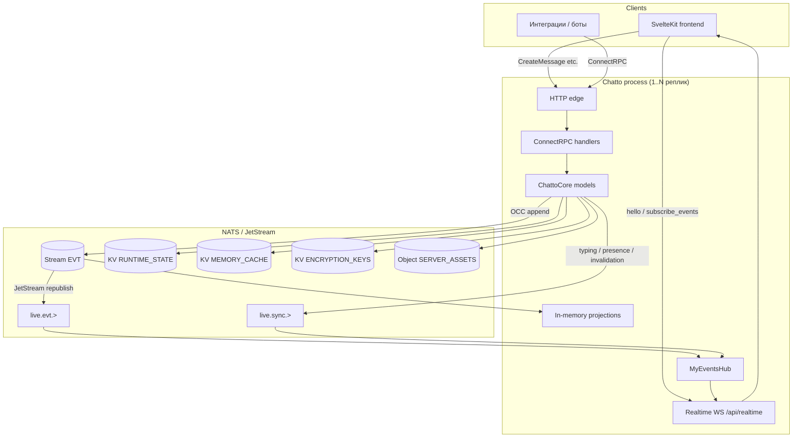
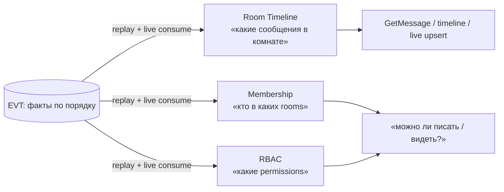
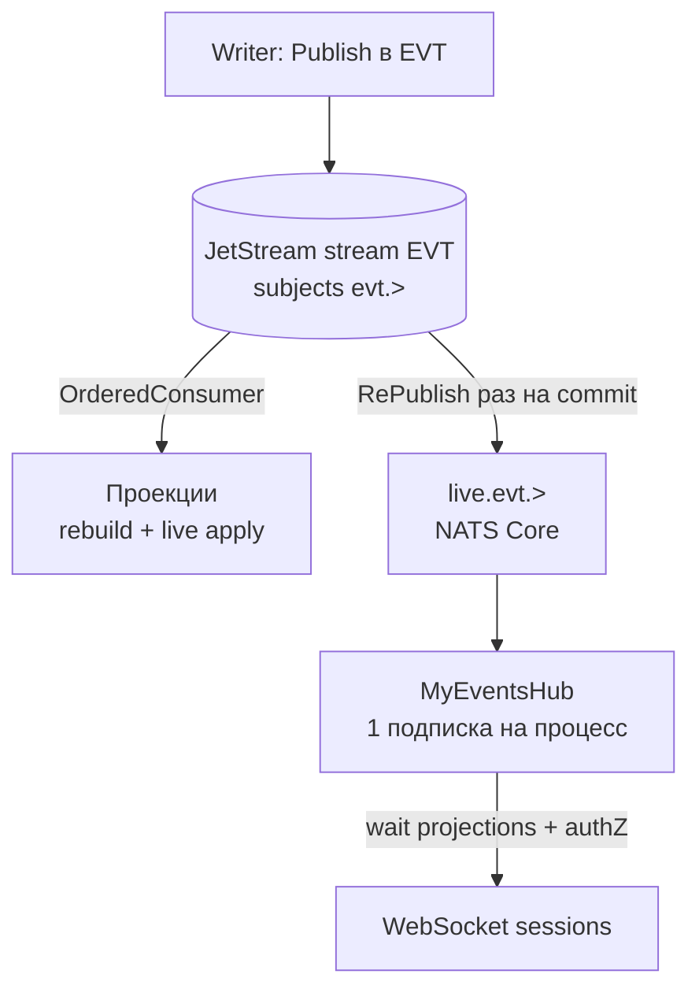
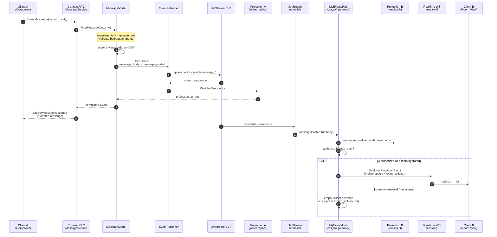
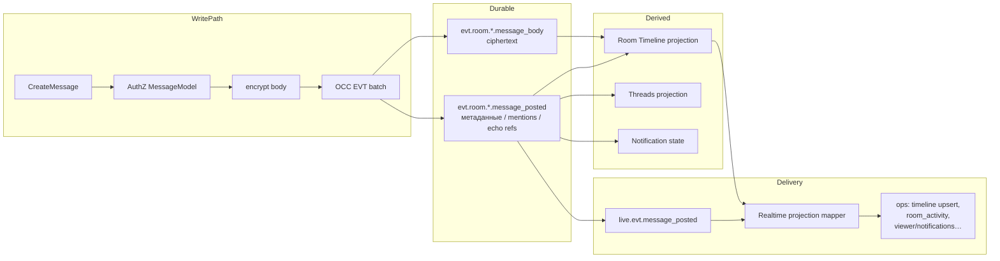
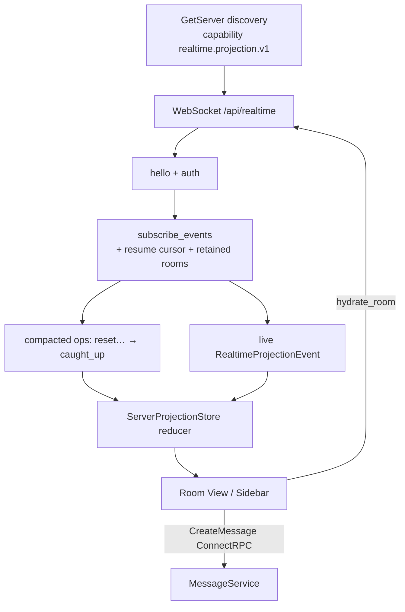
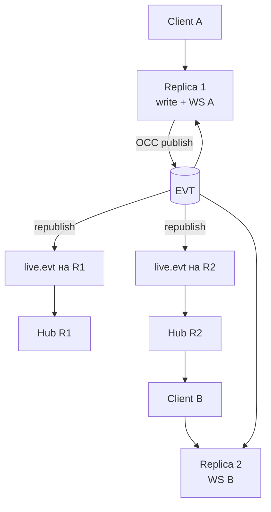

<!--
SPDX-FileCopyrightText: 2026 ChattoCorp GmbH
SPDX-License-Identifier: AGPL-3.0-or-later
-->

# Архитектура Chatto: обзор и путь сообщения

> Рабочий обзор (не канонический inventory). Актуальные факты runtime —
> в [`docs/architecture/`](../docs/architecture/INDEX.md), термины —
> в [`docs/GLOSSARY.md`](../docs/GLOSSARY.md).

Chatto — self-hosted realtime-чат с event-sourced ядром на NATS JetStream.
Публичный API — ConnectRPC; живое состояние клиента — WebSocket-проекция
(`/api/realtime`). Сообщение не «пушится» напрямую участнику: оно сначала
становится фактом в `EVT`, затем каждая реплика проецирует его и уже после
authZ отдаёт в сессии через process-wide hub.

---

## 1. Высокоуровневая схема

Ключевые свойства:

- **Несколько реплик** допустимы; корректность через JetStream/KV OCC, не через
  локальные локи.
- **`EVT`** — источник истины для доменных фактов (сообщения, комнаты, RBAC…).
- **Проекции** — процесс-локальные «сводки» из лога для быстрых чтений; writer
  ждёт свою проекцию (read-your-writes). Подробнее — §3.
- **Republish** — JetStream зеркалит commit из `EVT` на `live.evt.>`, чтобы
  realtime узнал о новом факте без per-socket JetStream consumer. Подробнее — §4.
- **Realtime** — не сырой EVT, а авторизованные `RealtimeProjectionOperation` /
  ephemeral envelopes.

---

## 2. Ключевые понятия

### Продукт

| Термин | Смысл |
|--------|--------|
| **Server** | Одно развёртывание Chatto: один процессный кластер, один NATS-аккаунт, граница membership |
| **Room** | Канал или DM; сообщения живут в `(serverId, roomId)` |
| **DM** | Room с `kind: dm`; доступ через membership, не через «модераторский» доступ к чужим ЛС |
| **Message** | Пользовательская запись в timeline комнаты (root или reply в thread) |
| **Thread** | Цепочка ответов от root-сообщения |
| **Echo** | Опциональный репост thread-reply в родительский канал |

### Транспорт и API

| Термин | Смысл |
|--------|--------|
| **ConnectRPC** | Публичный unary API (`chatto.api.v1`, `admin`, `auth`, `discovery`) |
| **Realtime protocol 2** | Бинарный WebSocket на `/api/realtime`: compacted bootstrap + resumable live projection |
| **Client Projection** | Серверно-скоупленный ordered feed операций; клиентский reducer сходится к текущему состоянию |
| **Operator API** | Root-эквивалент на Unix-сокете (`chatto.operator.v1`), не на публичном listener |

### Хранение и события

| Термин | Смысл |
|--------|--------|
| **EVT** | Единый JetStream-лог durable-фактов (`evt.{aggregate}.{id}.{type}`) |
| **Event** | Обёртка `corev1.Event` в `EVT` (например `MessagePosted` + отдельный `MessageBody`) |
| **Live Event** | Transient `corev1.LiveEvent` на `live.sync.>` (typing, presence, invalidation) |
| **Republish** | Фича JetStream: после commit в stream зеркалит сообщение на обычный NATS subject (`live.evt.>`). Нужна, чтобы realtime узнал «факт уже записан», не поднимая JetStream consumer на каждый WebSocket. Подробнее — §4 |
| **OCC** | Publish с expected subject/stream sequence; без «тихого» publish без concurrency guard |
| **Projection** | Не NATS: in-memory read-model Chatto из лога `EVT` (timeline, membership, RBAC…). Можно выкинуть и пересобрать. Подробнее — §3 |
| **RUNTIME_STATE** | Latest-value: сессии, токены, notifications, wrapped DEK и т.п. — вне доменной истории |
| **MyEventsHub** | Один process-wide подписчик на `live.evt.>` / `live.sync.>`, fanout в session queues |
| **Crypto-shredding** | Удаление доступа к контенту через уничтожение ключей, а не rewrite истории |

### Авторизация

| Термин | Смысл |
|--------|--------|
| **RBAC** | Роли + permissions + direct user decisions; scopes: server / group / room |
| **Permission** | Например `message.post`, `message.post-in-thread`, `message.echo` |
| **Effective owner** | Роль `owner` или email из `owners.emails` — полный RBAC bypass (DM privacy boundary остаётся) |

---

## 3. Что такое проекции

### Это не фича NATS

**Проекция — понятие Chatto / event sourcing, не термин NATS.** В NATS/JetStream
есть stream, consumer, KV, Object Store, RePublish. «Projection» там нет.

Разделение ролей:

| Слой | Чей это код / продукт | Что делает |
|------|------------------------|------------|
| **JetStream stream `EVT`** | NATS | Хранит append-only факты |
| **OrderedConsumer** | NATS | Доставляет факты проектору (replay + live) |
| **RePublish → `live.evt.>`** | NATS | Зеркалит commit на pubsub |
| **Проекция (Room Timeline, RBAC…)** | Chatto (`cli/internal/core`) | Go-структуры в RAM + `Apply(event)` — *как* интерпретировать факты для чтений |
| **Client Projection** | Chatto realtime protocol | Feed операций в браузер — тоже не NATS |

NATS даёт ленту событий; Chatto сам решает, какие срезы состояния из неё
собрать и держать в процессе.

### Проблема

`EVT` — append-only лог фактов («сообщение X опубликовано», «user Y вступил в
room»). Это удобно для записи и аудита, но **неудобно для чтения**: чтобы
ответить «покажи последние 50 сообщений комнаты» или «может ли user писать
сюда?», пришлось бы каждый раз переигрывать историю.

### Решение

**Проекция** — производное текущее состояние в памяти процесса Chatto:
Go-структуры, которые непрерывно потребляют `EVT` (через JetStream consumer) и
применяют факты (`Apply`). Читать API / realtime / OCC-решения идут в
проекцию; записать по-прежнему можно только в `EVT`.

Аналогия: журнал проводок в бухгалтерии = `EVT`; оборотно-сальдовая ведомость /
остатки на счетах = проекции. Журнал — правда; ведомость можно пересчитать заново.

### Свойства в Chatto

| Свойство | Что это значит на практике |
|----------|----------------------------|
| **Derived, не primary** | Если проекцию стереть, после replay `EVT` она восстановится. Backup истины — stream, не RAM |
| **Process-local** | У каждой реплики Chatto своя копия. Они сходятся к одному `EVT`, но не шарят одну структуру в памяти |
| **Много проекций** | Разные «срезы»: timeline комнаты, threads, каталог rooms, users, RBAC… Каждая подписана на свой набор subjects |
| **Read-your-writes** | После `CreateMessage` writer ждёт, пока *его* проекция догонит sequence этого publish — и только тогда отдаёт ответ API. Иначе ответ мог бы вернуть «сообщения ещё нет» |
| **Не путать с Client Projection** | Серверная проекция = in-memory read-model в Go. Client Projection = WebSocket feed операций для браузера (ADR-051). Второе *собирается из* первых после authZ |

Примеры серверных проекций, связанных с сообщениями: Room Timeline (видимые
строки чата), Threads, Reactions. Полный список —
[`docs/architecture/projections.md`](../docs/architecture/projections.md).

Без проекций путь «A написал → B увидел» всё равно требовал бы где-то держать
текущее состояние комнаты и membership; проекции — явное, переигрываемое место
для этого состояния.

---

## 4. Зачем делается republish

### Две разные подписки на одни и те же факты

После commit факт лежит в JetStream stream `EVT` (subjects `evt.>`). Его читают:

1. **Проекторы** — через JetStream *OrderedConsumer*: надёжный replay с начала /
   со snapshot, затем live. Это медленнее pubsub, зато переживает рестарт и
   даёт точный frontier «я применил до sequence N».
2. **Realtime hub (`MyEventsHub`)** — должен мгновенно узнать «появился новый
   committed факт» и раздать его в WebSocket-сессии. Ему не нужен отдельный
   durable consumer на каждый сокет.

### Что делает RePublish

JetStream умеет **после успешного accept** один раз опубликовать то же
сообщение на другой subject — в Chatto это `live.evt.>`. Это обычный NATS Core
pubsub: «факт уже durably записан», один сигнал на весь кластер, независимо от
числа реплик и числа клиентов.

### Зачем не обойтись без него

| Альтернатива | Почему хуже для Chatto |
|--------------|-------------------------|
| Писать в `EVT` и отдельно publish «live» из кода | Риск double-write / расхождения («live ушёл, а stream нет» или наоборот). Republish привязан к *успешному* commit |
| Каждый WebSocket = свой JetStream consumer | Дорого: N consumers × глобальный трафик, лишний decode ciphertext `message_body` на каждый сокет (ADR-049) |
| Hub читает только consumer проекций | Проекции догоняют асинхронно; нужен явный сигнал «commit случился» + wait до их frontier — это как раз `live.evt.` + wait |
| Отдавать клиентам сырой `evt.>` / `live.evt.>` | Утечка внутренних координат, нет per-user authZ, нет decrypt на границе. `live.evt.>` — **внутренний** feed |

### Важный нюанс

`live.evt.>` значит «факт **записан** в stream», **не** «все проекции всех
реплик уже применили его». Поэтому hub после republish:

1. берёт sequence из headers,
2. **ждёт** локальные проекции до этого sequence,
3. только потом авторизует и мапит в публичный realtime frame.

Итого: republish — мост «durable log → быстрый fanout внутри серверов»;
проекции — мост «лог фактов → удобное текущее состояние для чтений и authZ».

---

## 5. Путь сообщения: участник A → участник B

Сценарий: A и B — члены одной комнаты (канал или DM). У обоих открыт realtime
protocol 2; A пишет в Composer.

### Шаги подробно

1. **Клиент A (мутация)**  
   Composer вызывает `MessageService.CreateMessage` по ConnectRPC. Ответ — уже
   hydrated публичное сообщение (read-your-writes на writer-реплике).

2. **Авторизация** (`MessageModel`)  
   Проверки: членство в room, `message.post` / `message.post-in-thread`, при
   echo — `message.echo`. Preflight может идти до upload вложений.

3. **Шифрование тела**  
   Plaintext не кладётся в публичный live-путь как есть. Пишется отдельный факт
   `MessageBody` (ciphertext) + метаданные `MessagePosted`. При live-доставке
   subject `message_body` отбрасывается на hub **до decode** (ADR-049).

4. **Durable write**  
   Atomic OCC-batch в `EVT`, типичные subjects:
   - `evt.room.{roomId}.message_body`
   - `evt.room.{roomId}.message_posted`  
   Writer ждёт локальную room-timeline (и смежные) проекции до ответа API.

5. **Fanout внутри кластера**  
   JetStream republish → `live.evt.>`. На **каждой** реплике `MyEventsHub` один
   раз декодирует событие, ждёт проекции, проверяет visibility per user, кладёт
   в bounded session queues. Per-client JetStream consumers нет.

6. **Клиент B**  
   Если у B комната в retained set — приходит `room_timeline_event` upsert
   (текущий renderable row, не сырой EVT). Если timeline не hydrated — часто
   только `room_activity` / summary без расшифровки тела. Неучастник / потеря
   membership — событие не доставляется; при revoke — privacy fence (purge
   зеркал).

7. **Параллельно у A**  
   Optimistic UI + подтверждение из RPC; live-проекция тоже может upsert ту же
   строку (idempotent reducer).

---

## 6. Схема данных вокруг сообщения

Важно: **доставка B не читает `message_body` с wire**. Mapper собирает
публичный row из проекции (decrypt на auth boundary ответа), поэтому
cursor/replay не обгоняет готовность проекции.

---

## 7. Клиентская сторона (сжато)

- ConnectRPC остаётся API мутаций и явных reads/pagination.
- Realtime — convergence feed, не замена resource API.
- Cursor opaque, encrypted, viewer-bound; NATS sequence наружу не светится.

---

## 8. Multi-replica картина

Read-your-writes гарантируется **на writer-процессе**. На другой реплике B
увидит сообщение после catch-up её проекции (обычно субмиллисекунды; API двух
реплик могут кратковременно расходиться — это принято для чата, ADR-033).

---

## 9. Что не является путём «сообщения»

| Сигнал | Путь | Persist? |
|--------|------|----------|
| Typing | `live.sync.>` → hub → `RealtimeEventEnvelope` | Нет |
| Presence | `MEMORY_CACHE` + PresenceHub / live | Latest-value, не EVT |
| Notifications | RUNTIME_STATE + projection ops | Latest-value |
| Push (если настроен) | durable effect вне WS | Отдельно от timeline |

Для чата «увидел в Room View» = **EVT → projection → authorized realtime op**
(или ConnectRPC read).

---

## 10. Карта слоёв кода (ориентиры)

| Слой | Где смотреть |
|------|----------------|
| Публичный RPC | `proto/chatto/api/v1/messages.proto`, `cli/internal/connectapi/messages.go` |
| AuthZ + post | `cli/internal/core/message_model.go`, `messages.go` |
| Publish / OCC | `cli/internal/events/publisher.go` |
| Subjects | `docs/architecture/subjects-and-events.md` |
| Projections | `docs/architecture/projections.md` |
| Live hub | `cli/internal/core/my_events_model.go`, ADR-049 |
| Realtime WS | `cli/internal/http_server/realtime.go`, ADR-051 |
| Frontend reducer | `apps/frontend/src/lib/state/server/projection.svelte.ts` |
| Инвентарь | `docs/architecture/INDEX.md` |
| Термины | `docs/GLOSSARY.md` |

---

## Краткий вывод

Сообщение от A к B — это **commit durable факта в EVT**, затем
**проекция + per-user authorization**, затем **ordered projection operation**
по уже открытому WebSocket B.

- **Проекция** отвечает на вопрос «как сейчас выглядит мир для чтений» (timeline,
  кто в room, permissions), не храня это как отдельный CRUD primary store.
- **Republish** отвечает на вопрос «как realtime быстро узнать, что commit
  состоялся», одним pubsub-сигналом на кластер, без consumer на каждый сокет.

Прямого peer-to-peer нет: общий log, локальные проекции, один hub на процесс,
ConnectRPC для записи и явных чтений.
