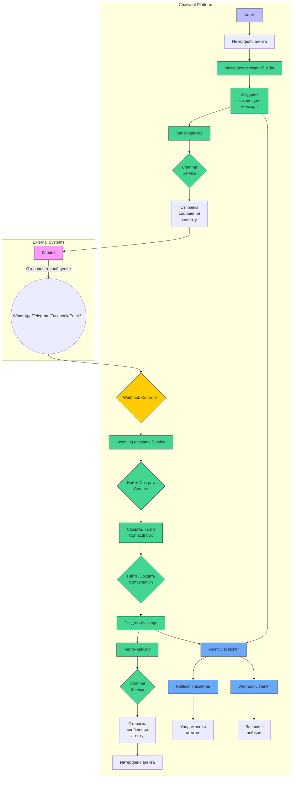

# Архитектура Chatwoot: Прохождение сообщения между участниками

## Ключевые понятия

### Contact (Контакт)
Представляет пользователя, который взаимодействует с системой. Каждый контакт имеет уникальный идентификатор и может иметь дополнительные атрибуты (имя, телефон, email и т.д.). Контакты создаются при первом взаимодействии через любой канал.

### Inbox (Ящик)
Логическая единица, представляющая канал связи с определенным типом (WebWidget, WhatsApp, Email и др.). Ящик связывает канал с аккаунтом и содержит настройки, участников (агентов) и настройки работы.

### Channel (Канал)
Конкретная интеграция с внешней платформой (WhatsApp, Telegram, Facebook и т.д.). Каждый канал имеет свои специфические атрибуты (токены доступа, номера телефонов и т.д.) и реализует логику взаимодействия с внешним сервисом.

### Conversation (Разговор)
Представляет диалог между контактом и агентами. Разговор содержит последовательность сообщений и имеет статус (открыт, решен, ожидающий и т.д.).

### Message (Сообщение)
Единица обмена информацией в разговоре. Сообщение может быть входящим (от контакта) или исходящим (от агента), а также иметь различные типы контента (текст, файл, местоположение и т.д.).

### ContactInbox
Связующая сущность между Contact и Inbox. Хранит source_id - уникальный идентификатор контакта в рамках конкретного канала (например, номер телефона для WhatsApp, user_id для Telegram). Это позволяет одному пользователю иметь разные идентификаторы в разных каналах, но быть представленным одним Contact в системе.

## Архитектурная схема

## Прохождение сообщения от участника к участнику

### 1. Входящее сообщение от клиента

Когда клиент отправляет сообщение через любой поддерживаемый канал (WhatsApp, Telegram и т.д.), происходит следующая последовательность действий:

1. **Прием вебхука**: Внешняя платформа отправляет вебхук на соответствующий контроллер в Chatwoot (например, `Webhooks::WhatsappController`).
2. **Обработка в фоне**: Контроллер ставит задачу в очередь (`Webhooks::WhatsappEventsJob`), чтобы не блокировать HTTP-ответ.
3. **Анализ сообщения**: Соответствующий сервис (`Whatsapp::IncomingMessageService`) анализирует полезную нагрузку вебхука.
4. **Поиск/Создание контакта**: Система пытается найти существующий контакт по `source_id` (например, номеру телефона). Если контакт не найден, создается новый.
5. **Поиск/Создание ContactInbox**: Создается или находится существующая связь между контактом и ящиком.
6. **Поиск/Создание разговора**: Система ищет активный разговор для этой пары контакт-ящик. Если разговор не найден или закрыт (и настройки не запрещают), создается новый.
7. **Создание сообщения**: Создается новая запись `Message` с типом `incoming`, которая сохраняется в базе данных.
8. **Уведомления**: Через `AsyncDispatcher` срабатывает `NotificationListener`, который уведомляет назначенных агентов о новом сообщении.

### 2. Исходящее сообщение от агента

Когда агент отправляет ответ через интерфейс Chatwoot:

1. **Создание сообщения**: Фронтенд отправляет запрос на создание сообщения.
2. **Построение сообщения**: Сервис `Messages::MessageBuilder` создает объект `Message` с типом `outgoing`.
3. **Сохранение и фоновая обработка**: Сообщение сохраняется в базу, и срабатывает callback, который ставит в очередь задачу `SendReplyJob`.
4. **Отправка через канал**: `SendReplyJob` определяет тип канала и использует соответствующий сервис (например, `Whatsapp::SendOnWhatsappService`) для отправки сообщения через внешний API.
5. **Обновление статуса**: Статус сообщения обновляется на "отправлено", "доставлено" или "прочитано" на основе вебхуков от внешней платформы.

## Важные особенности архитектуры

- **Асинхронная обработка**: Критически важные операции (прием вебхуков, отправка сообщений) выполняются асинхронно через очереди задач (Sidekiq), что обеспечивает высокую производительность и отказоустойчивость.
- **Диспетчеризация событий**: Система использует `Dispatcher` (с синхронными и асинхронными слушателями) для реакции на события в системе, что позволяет легко расширять функциональность.
- **Гибкая модель каналов**: Архитектура каналов (Channel) позволяет легко добавлять новые интеграции, реализуя единый интерфейс.
- **Централизованное управление сообщениями**: Все сообщения проходят через единые сервисы построения и отправки, что обеспечивает консистентность поведения.
- **Масштабируемость**: Разделение на микросервисы (веб-интерфейс, фоновые задачи, база данных) позволяет масштабировать компоненты независимо.
