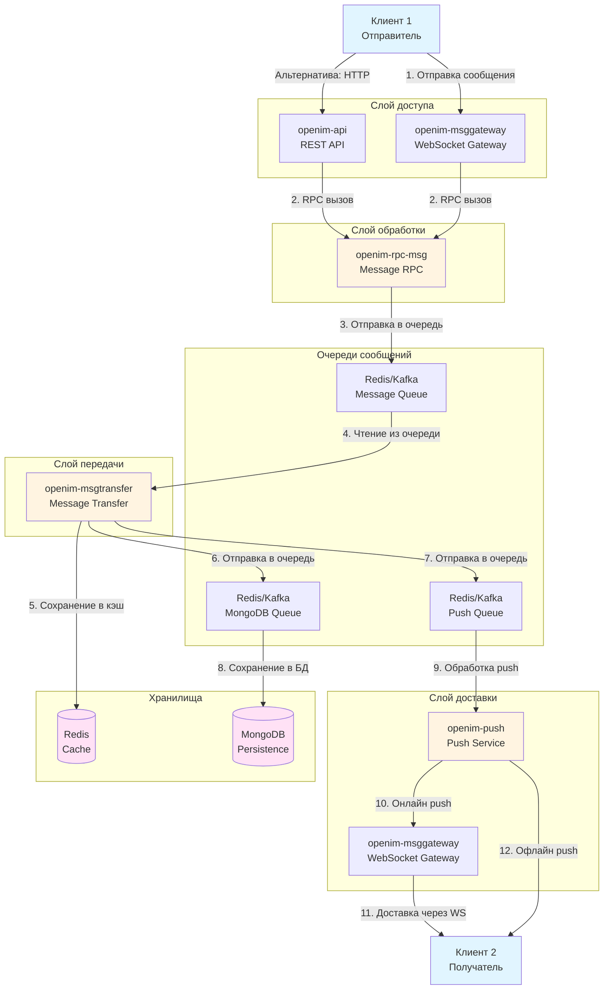
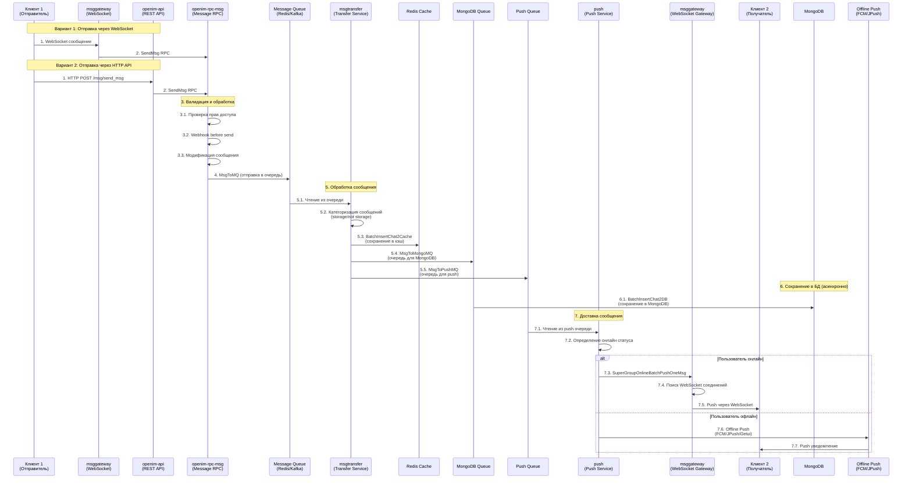
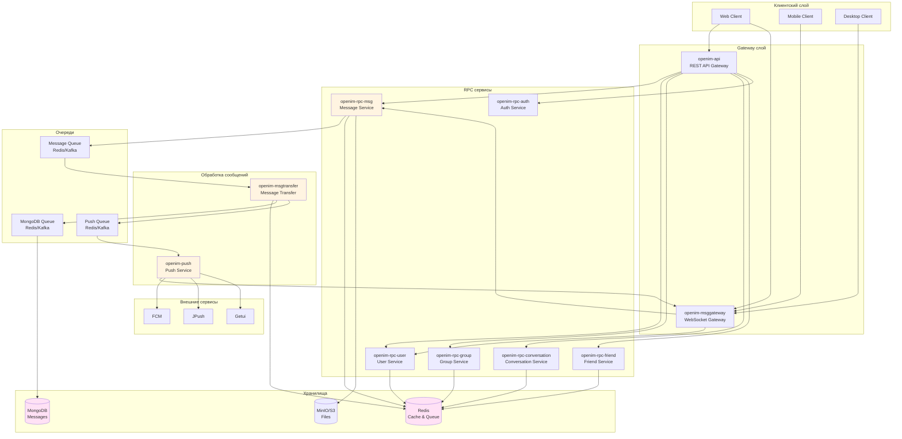
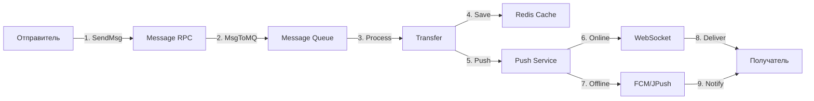
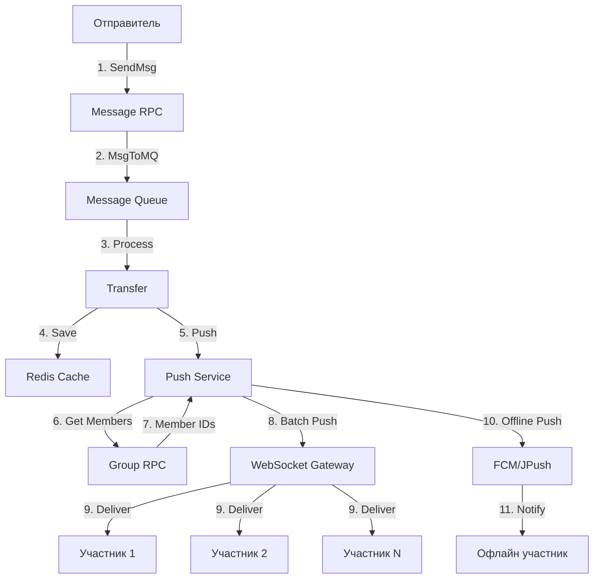

# Анализ архитектуры OpenIM Server

## Обзор проекта

OpenIM Server - это серверная часть системы мгновенного обмена сообщениями, построенная на микросервисной архитектуре. Проект написан на Go и поддерживает масштабирование для работы с большим количеством пользователей и сообщений.

## Основные компоненты системы

### 1. API Gateway (`openim-api`)
- **Назначение**: REST API для внешних систем и административных операций
- **Основные функции**:
  - Отправка сообщений через HTTP API
  - Управление пользователями, группами, друзьями
  - Административные операции

### 2. Message Gateway (`openim-msggateway`)
- **Назначение**: WebSocket шлюз для реального времени
- **Основные функции**:
  - Управление WebSocket соединениями
  - Прием сообщений от клиентов через WebSocket
  - Доставка сообщений клиентам в реальном времени
  - Управление онлайн статусом пользователей

### 3. Message RPC (`openim-rpc-msg`)
- **Назначение**: RPC сервис для обработки сообщений
- **Основные функции**:
  - Валидация сообщений
  - Обработка webhook'ов (before/after send)
  - Отправка сообщений в очередь для дальнейшей обработки
  - Поддержка разных типов чатов (single, group, notification)

### 4. Message Transfer (`openim-msgtransfer`)
- **Назначение**: Передача и сохранение сообщений
- **Основные функции**:
  - Чтение сообщений из очереди (Redis/Kafka)
  - Сохранение в Redis кэш
  - Отправка в очередь для MongoDB
  - Отправка в очередь для push уведомлений
  - Обработка последовательностей (seq) сообщений

### 5. Push Service (`openim-push`)
- **Назначение**: Доставка push уведомлений
- **Основные функции**:
  - Определение онлайн/офлайн статуса пользователей
  - Онлайн push через WebSocket (через msggateway)
  - Офлайн push через внешние сервисы (FCM, JPush, Getui и др.)

### 6. Другие RPC сервисы
- `openim-rpc-user`: Управление пользователями
- `openim-rpc-group`: Управление группами
- `openim-rpc-conversation`: Управление беседами
- `openim-rpc-friend`: Управление друзьями
- `openim-rpc-auth`: Аутентификация

## Поток сообщения от отправителя к получателю

### Общая схема потока



### Детальный поток отправки сообщения



### Архитектура компонентов



## Детальный анализ потока сообщения

### Этап 1: Отправка сообщения клиентом

**Через WebSocket:**
1. Клиент устанавливает WebSocket соединение с `openim-msggateway`
2. Клиент отправляет сообщение через WebSocket с типом `WSSendMsg` (1003)
3. `msggateway` обрабатывает сообщение в `message_handler.go:SendMessage`
4. Вызывается RPC `msg.SendMsg`

**Через HTTP API:**
1. Клиент отправляет POST запрос на `/msg/send_msg`
2. `openim-api` обрабатывает в `msg.go:SendMessage`
3. Проверяются права доступа (только app manager)
4. Вызывается RPC `msg.SendMsg`

### Этап 2: Обработка в Message RPC

**Файл:** `internal/rpc/msg/send.go`

1. **Валидация доступа** (`authverify.CheckAccess`)
2. **Определение типа чата**:
   - `SingleChatType` - личный чат
   - `ReadGroupChatType` - групповой чат
   - `NotificationChatType` - уведомления
3. **Webhook before send** (если настроен)
4. **Модификация сообщения** (webhook before modify)
5. **Отправка в очередь** через `MsgDatabase.MsgToMQ`

**Ключевой код:**
```go
// internal/rpc/msg/send.go:81
err = m.MsgDatabase.MsgToMQ(ctx, 
    conversationutil.GenConversationUniqueKeyForGroup(req.MsgData.GroupID), 
    req.MsgData)
```

### Этап 3: Обработка в Message Transfer

**Файл:** `internal/msgtransfer/online_history_msg_handler.go`

1. **Чтение из очереди** - `HandlerRedisMessage`
2. **Батчинг** - сообщения группируются по ключу (conversationID)
3. **Категоризация**:
   - Сообщения для хранения (`IsHistory`)
   - Сообщения только для push (`!IsHistory`)
   - Уведомления
4. **Сохранение в Redis**:
   - `BatchInsertChat2Cache` - сохранение в кэш
   - Установка последовательностей (seq)
5. **Отправка в MongoDB очередь** - `MsgToMongoMQ`
6. **Отправка в Push очередь** - `MsgToPushMQ`

**Ключевой код:**
```go
// internal/msgtransfer/online_history_msg_handler.go:267
lastSeq, isNewConversation, userSeqMap, err := 
    och.msgTransferDatabase.BatchInsertChat2Cache(ctx, conversationID, storageMessageList)
```

### Этап 4: Сохранение в MongoDB

**Файл:** `internal/msgtransfer/online_msg_to_mongo_handler.go`

1. **Чтение из MongoDB очереди**
2. **Батч вставка** - `BatchInsertChat2DB`
3. **Webhook after save** (если настроен)

### Этап 5: Доставка через Push Service

**Файл:** `internal/push/push_handler.go`

1. **Чтение из Push очереди** - `HandleMs2PsChat`
2. **Определение типа доставки**:
   - Групповой чат → `Push2Group`
   - Личный чат → `Push2User`
3. **Проверка онлайн статуса**:
   - `GetUsersOnlineStatus` - проверка через Redis кэш
4. **Онлайн доставка**:
   - `GetConnsAndOnlinePush` - получение WebSocket соединений
   - `SuperGroupOnlineBatchPushOneMsg` - отправка через msggateway
5. **Офлайн доставка** (если онлайн доставка не удалась):
   - Фильтрация пользователей (не беспокоить и т.д.)
   - Отправка через внешние сервисы (FCM, JPush, Getui)

**Ключевой код:**
```go
// internal/push/push_handler.go:195
onlineUserIDs, offlineUserIDs, err := c.onlineCache.GetUsersOnline(ctx, pushToUserIDs)
```

### Этап 6: Доставка через WebSocket Gateway

**Файл:** `internal/msggateway/hub_server.go`

1. **Получение соединений** - `GetUserAllCons(userID)`
2. **Отправка сообщения** - `pushToUser`
3. **Проверка фона** - если приложение в фоне (iOS), не отправлять
4. **Push через WebSocket** - `client.PushMessage(ctx, msgData)`

## Типы сообщений и их обработка

### 1. Личный чат (SingleChatType)



### 2. Групповой чат (ReadGroupChatType)



### 3. Уведомления (NotificationChatType)

Обрабатываются аналогично личному чату, но с дополнительной логикой для системных уведомлений.

## Хранилища данных

### Redis
- **Кэш сообщений** - быстрый доступ к последним сообщениям
- **Онлайн статус** - информация о подключенных пользователях
- **Последовательности (seq)** - порядковые номера сообщений
- **Очереди** - для асинхронной обработки

### MongoDB
- **История сообщений** - долгосрочное хранение
- **Метаданные** - информация о беседах, пользователях, группах

### MinIO/S3
- **Файлы** - изображения, видео, документы

## Очереди сообщений

Система использует очереди (Redis Streams или Kafka) для:
1. **Асинхронной обработки** - разгрузка RPC сервисов
2. **Масштабирования** - возможность горизонтального масштабирования
3. **Надежности** - гарантия доставки сообщений

**Основные очереди:**
- **Message Queue** - для передачи сообщений в transfer
- **MongoDB Queue** - для сохранения в БД
- **Push Queue** - для доставки push уведомлений

## Webhook'и

Система поддерживает webhook'и на разных этапах:
- **BeforeSendSingleMsg** - перед отправкой личного сообщения
- **AfterSendSingleMsg** - после отправки личного сообщения
- **BeforeSendGroupMsg** - перед отправкой группового сообщения
- **AfterSendGroupMsg** - после отправки группового сообщения
- **BeforeMsgModify** - перед модификацией сообщения
- **AfterMsgSaveDB** - после сохранения в БД
- **BeforeOnlinePush** - перед онлайн push
- **BeforeOfflinePush** - перед офлайн push

## Масштабирование

### Горизонтальное масштабирование
- **msggateway** - можно запускать несколько инстансов
- **msgtransfer** - можно запускать несколько инстансов (consumer groups)
- **push** - можно запускать несколько инстансов
- **RPC сервисы** - можно запускать несколько инстансов

### Вертикальное масштабирование
- Настройка размеров батчей
- Настройка количества воркеров
- Настройка размеров очередей

## Заключение

OpenIM Server использует современную микросервисную архитектуру с разделением ответственности:
- **Gateway слой** - точка входа для клиентов
- **RPC слой** - бизнес-логика
- **Transfer слой** - обработка и сохранение
- **Push слой** - доставка сообщений

Поток сообщения проходит через несколько этапов с использованием очередей для асинхронной обработки, что обеспечивает высокую производительность и надежность системы.

