# Анализ архитектуры Synapse

## Введение

Synapse — это реализация homeserver для протокола Matrix, написанная на Python. Matrix — это открытый стандарт для децентрализованной коммуникации, поддерживающий федерацию, шифрование и VoIP.

Данный документ описывает архитектуру Synapse с особым вниманием к процессу передачи сообщений между участниками.

## Ключевые понятия

### Event (Событие)

**Event** — это основная единица данных в Matrix. События представляют собой неизменяемые (immutable) записи, которые описывают изменения в комнатах (rooms). Каждое событие имеет:
- `event_id` — уникальный идентификатор
- `room_id` — идентификатор комнаты
- `type` — тип события (например, `m.room.message`, `m.room.member`)
- `sender` — отправитель события
- `content` — содержимое события
- `prev_events` — ссылки на предыдущие события (формируют DAG)
- `auth_events` — события, необходимые для авторизации
- `depth` — глубина в графе событий

### Room (Комната)

**Room** — это виртуальное пространство, где участники обмениваются событиями. Комната имеет:
- Уникальный `room_id`
- Версию протокола комнаты (`room_version`)
- Граф событий (DAG — Directed Acyclic Graph)
- Текущее состояние (state), определяемое последними state-событиями

### Homeserver

**Homeserver** — это сервер, который управляет пользователями и комнатами. Каждый homeserver:
- Хранит данные своих пользователей
- Управляет комнатами, созданными на этом сервере
- Обменивается событиями с другими homeservers через федерацию

### Federation (Федерация)

**Federation** — это механизм, позволяющий homeservers обмениваться событиями друг с другом. Когда пользователь на одном сервере отправляет сообщение в комнату, где есть участники с других серверов, его homeserver отправляет событие на homeservers других участников.

### PDU (Persistent Data Unit)

**PDU** — это термин, используемый в протоколе federation для обозначения событий, передаваемых между серверами. PDU — это по сути то же самое, что и Event, но в контексте межсерверной коммуникации.

### EDU (Ephemeral Data Unit)

**EDU** — это временные данные, передаваемые между серверами (например, typing indicators, presence updates). В отличие от PDU, EDU не сохраняются в базе данных.

### State Event

**State Event** — это особый тип события, который изменяет состояние комнаты. Примеры: `m.room.member` (членство), `m.room.power_levels` (права доступа), `m.room.name` (название комнаты).

### Timeline Event

**Timeline Event** — это событие, которое появляется в истории комнаты (например, текстовые сообщения). В отличие от state events, timeline events не изменяют состояние комнаты напрямую.

### Stream

**Stream** — это механизм репликации в Synapse. Stream представляет собой append-only лог изменений в базе данных. Различные типы streams:
- Events stream — новые события
- Account data stream — изменения в account data пользователей
- To-device stream — сообщения для устройств
- И другие

### Notifier

**Notifier** — это компонент, который уведомляет подключенных клиентов о новых событиях. Когда событие сохраняется в базе данных, Notifier разбудит клиентов, ожидающих обновлений через `/sync`.

### Handler

**Handler** — это класс, который обрабатывает определенный тип операций. Например:
- `MessageHandler` — обработка сообщений
- `FederationHandler` — обработка federation запросов
- `EventHandler` — обработка событий
- `RoomMemberHandler` — обработка членства в комнатах

### Requester

**Requester** — это объект, представляющий пользователя, делающего запрос. Содержит информацию о пользователе, устройстве, аутентификации и т.д.

### EventContext

**EventContext** — это контекст события, содержащий информацию о состоянии комнаты на момент создания события. Включает:
- Предыдущее состояние (prev_state)
- Текущее состояние (current_state)
- State groups для оптимизации

## Общая архитектура

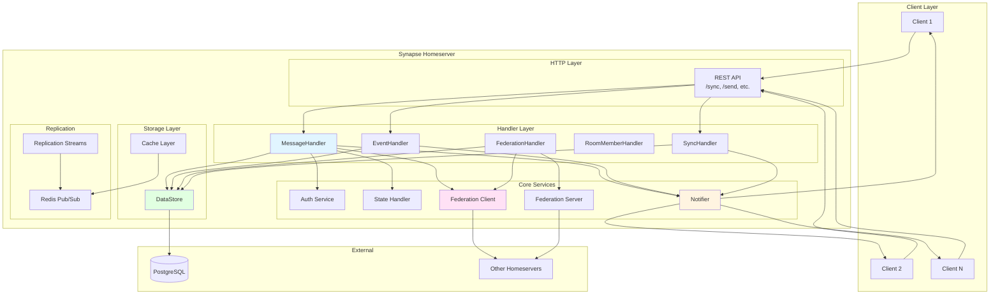

## Детальный поток сообщения между участниками

### Сценарий: Отправка сообщения в комнату

Рассмотрим сценарий, когда пользователь A на homeserver1 отправляет сообщение в комнату, где также находятся пользователи B (на homeserver1) и C (на homeserver2).

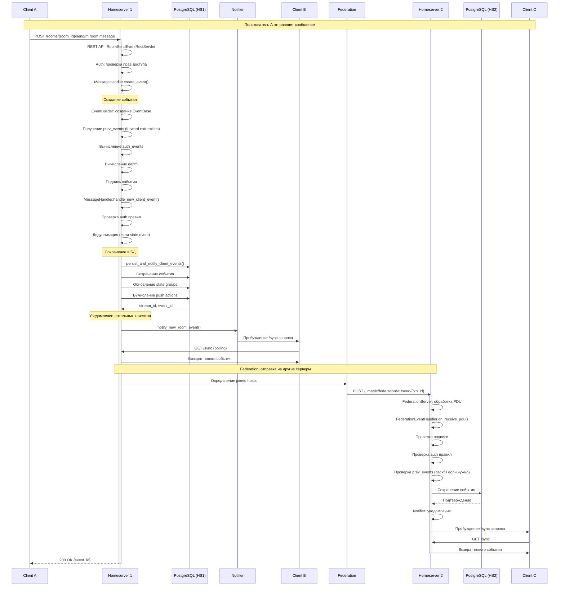

### Детальный поток обработки события

```mermaid
flowchart TD
    START([Клиент отправляет<br/>POST /send]) --> AUTH_CHECK{Проверка<br/>авторизации}
    AUTH_CHECK -->|Не авторизован| ERROR1[403 Forbidden]
    AUTH_CHECK -->|Авторизован| CREATE[MessageHandler.create_event]
    
    CREATE --> GET_PREV[Получение prev_events<br/>forward extremities]
    GET_PREV --> GET_AUTH[Вычисление auth_events<br/>из state комнаты]
    GET_AUTH --> CALC_DEPTH[Вычисление depth<br/>max prev_events depth + 1]
    CALC_DEPTH --> BUILD[EventBuilder:<br/>создание EventBase]
    BUILD --> VALIDATE[Валидация события]
    
    VALIDATE --> HANDLE[handle_new_client_event]
    HANDLE --> DEDUP{State event?}
    DEDUP -->|Да| CHECK_DEDUP[Проверка дедупликации]
    DEDUP -->|Нет| AUTH_RULES
    CHECK_DEDUP -->|Дубликат| RETURN_DUP[Возврат существующего события]
    CHECK_DEDUP -->|Новый| AUTH_RULES
    
    AUTH_RULES[Проверка auth правил<br/>event_auth.check]
    AUTH_RULES -->|Не прошло| ERROR2[403 Auth Error]
    AUTH_RULES -->|Прошло| PERSIST
    
    PERSIST[persist_and_notify_client_events]
    PERSIST --> STORE_DB[(Сохранение в БД)]
    STORE_DB --> UPDATE_STATE[Обновление state groups]
    UPDATE_STATE --> PUSH_ACTIONS[Вычисление push actions]
    PUSH_ACTIONS --> STREAM_ID[Получение stream_id]
    
    STREAM_ID --> NOTIFY_LOCAL[Notifier:<br/>уведомление локальных клиентов]
    NOTIFY_LOCAL --> FED_CHECK{Есть ли<br/>remote участники?}
    
    FED_CHECK -->|Нет| END1([Готово])
    FED_CHECK -->|Да| FED_SEND[FederationSender:<br/>отправка на remote серверы]
    
    FED_SEND --> QUEUE[Добавление в очередь<br/>per-destination queue]
    QUEUE --> TXN[Создание transaction<br/>с batch PDUs]
    TXN --> HTTP_SEND[HTTP POST<br/>/_matrix/federation/v1/send]
    HTTP_SEND --> REMOTE_PROC[Remote сервер<br/>обрабатывает PDU]
    REMOTE_PROC --> END2([Готово])
    
    style START fill:#e1f5ff
    style PERSIST fill:#fff4e1
    style FED_SEND fill:#ffe1f5
    style STORE_DB fill:#e1ffe1
```

## Компоненты системы

### REST API Layer

REST API предоставляет HTTP интерфейс для клиентов Matrix. Основные endpoints:

- **`/sync`** — получение обновлений (long polling)
- **`/rooms/{room_id}/send/{event_type}`** — отправка события
- **`/rooms/{room_id}/messages`** — получение истории сообщений
- **`/rooms/{room_id}/state`** — получение состояния комнаты

Файлы: `synapse/rest/client/*.py`

### MessageHandler

`MessageHandler` отвечает за создание и обработку событий от клиентов.

**Ключевые методы:**
- `create_event()` — создание нового события из данных клиента
- `handle_new_client_event()` — обработка нового события (auth, persist, notify)
- `persist_and_notify_client_events()` — сохранение в БД и уведомление

Файл: `synapse/handlers/message.py`

### EventHandler

`EventHandler` предоставляет методы для получения событий.

**Ключевые методы:**
- `get_event()` — получение события по ID
- `get_events()` — получение множества событий

Файл: `synapse/handlers/events.py`

### FederationHandler

`FederationHandler` обрабатывает межсерверную коммуникацию.

**Ключевые методы:**
- `send_invite()` — отправка приглашения
- `on_backfill_request()` — обработка запросов на backfill
- `maybe_backfill()` — инициация backfill при необходимости

Файл: `synapse/handlers/federation.py`

### FederationEventHandler

`FederationEventHandler` обрабатывает входящие события от других серверов.

**Ключевые методы:**
- `on_receive_pdu()` — обработка входящего PDU
- `on_send_membership_event()` — обработка membership событий

Файл: `synapse/handlers/federation_event.py`

### Notifier

`Notifier` управляет уведомлениями клиентов о новых событиях.

**Ключевые методы:**
- `notify_new_room_event()` — уведомление о новом событии в комнате
- `get_events_for()` — получение событий для пользователя (используется в /sync)

Файл: `synapse/notifier.py`

### State Handler

`StateHandler` управляет состоянием комнат.

**Ключевые функции:**
- Разрешение конфликтов состояния
- Вычисление текущего состояния комнаты
- Управление state groups для оптимизации

Файлы: `synapse/state/*.py`

### Storage Layer

Storage layer предоставляет абстракцию над базой данных.

**Основные компоненты:**
- `DataStore` — основной интерфейс к БД
- `EventStore` — хранение событий
- `StateStore` — хранение состояния
- `RoomStore` — информация о комнатах

Файлы: `synapse/storage/*.py`

### Federation Client

`FederationClient` отправляет запросы на другие homeservers.

**Ключевые методы:**
- `send_transaction()` — отправка transaction с PDUs
- `get_pdu()` — запрос конкретного PDU
- `backfill()` — запрос истории событий

Файл: `synapse/federation/federation_client.py`

### Federation Server

`FederationServer` обрабатывает входящие federation запросы.

**Ключевые функции:**
- HTTP сервер для `/federation/v1/*` endpoints
- Обработка `/send/{txn_id}` — получение PDUs
- Обработка `/backfill` — запросы истории

Файл: `synapse/federation/federation_server.py`

## Поток данных при отправке сообщения

### 1. Прием запроса от клиента

```python
# synapse/rest/client/room.py
class RoomSendEventRestServlet:
    async def on_PUT(self, request, room_id, event_type):
        # Парсинг запроса
        # Создание Requester
        # Вызов MessageHandler
```

### 2. Создание события

```python
# synapse/handlers/message.py
class MessageHandler:
    async def create_event(self, requester, event_dict):
        # Получение room_version
        # Создание EventBuilder
        # Получение prev_events
        # Вычисление auth_events
        # Вычисление depth
        # Подпись события
```

### 3. Обработка и сохранение

```python
# synapse/handlers/message.py
class MessageHandler:
    async def handle_new_client_event(self, requester, events_and_context):
        # Проверка auth правил
        # Дедупликация (для state events)
        # Вызов persist_and_notify_client_events
```

### 4. Сохранение в БД

```python
# synapse/handlers/message.py
class MessageHandler:
    async def persist_and_notify_client_events(self, ...):
        # Сохранение события в events таблицу
        # Обновление state groups
        # Вычисление push actions
        # Получение stream_id
        # Уведомление Notifier
```

### 5. Уведомление локальных клиентов

```python
# synapse/notifier.py
class Notifier:
    async def notify_new_room_event(self, event, max_room_stream_id):
        # Пробуждение всех /sync запросов для пользователей в комнате
        # Обновление stream tokens
```

### 6. Federation отправка

```python
# synapse/federation/sender.py
class FederationSender:
    async def send_event(self, destinations, event):
        # Определение joined hosts
        # Добавление в per-destination queue
        # Создание transaction
        # HTTP POST на remote серверы
```

### 7. Обработка на remote сервере

```python
# synapse/federation/federation_server.py
class FederationServer:
    async def on_send(self, request, txn_id):
        # Получение PDUs из transaction
        # Для каждого PDU:
        #   - Проверка подписи
        #   - Проверка auth правил
        #   - Проверка prev_events
        #   - Сохранение в БД
        #   - Уведомление Notifier
```

## Архитектура с workers

Synapse поддерживает горизонтальное масштабирование через workers — отдельные процессы, которые обрабатывают различные типы запросов.

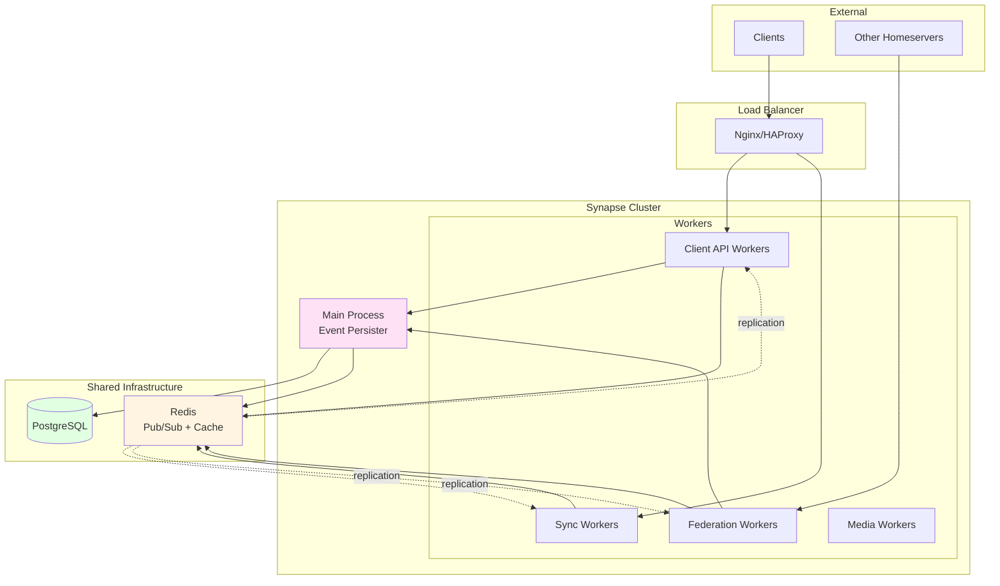

### Типы workers

1. **Main Process** — единственный процесс, который может писать события в БД
2. **Sync Workers** — обрабатывают `/sync` запросы
3. **Federation Workers** — обрабатывают federation запросы
4. **Client API Workers** — обрабатывают другие клиентские запросы
5. **Media Workers** — обрабатывают медиа файлы

### Репликация между процессами

Workers используют Redis pub/sub для получения обновлений о новых событиях:

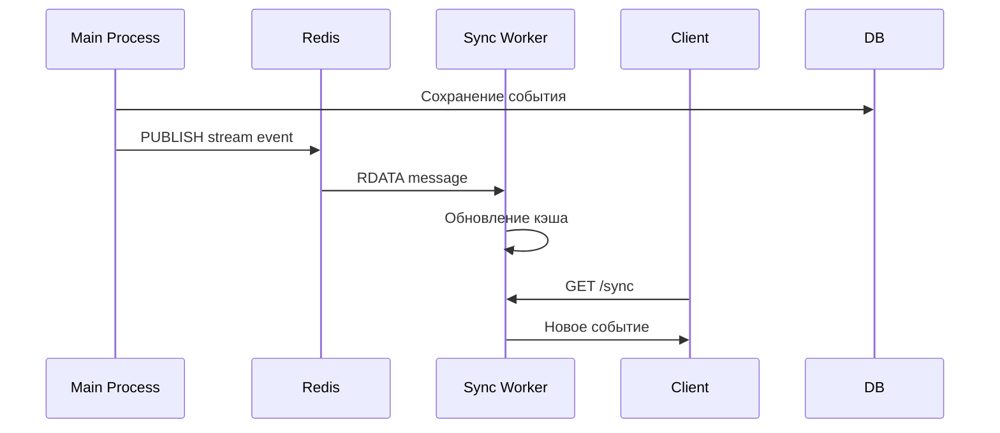

## Механизм prev_events: Зачем нужны ссылки на предыдущие события

### Проблема: Как обеспечить порядок и консистентность в распределенной системе?

В Matrix события могут приходить с разных серверов, в разное время, и даже в неправильном порядке. Как гарантировать, что все серверы видят события в одинаковом порядке? Как разрешить конфликты, когда два пользователя одновременно отправляют сообщения?

**Ответ: Directed Acyclic Graph (DAG) через `prev_events`**

### Что такое prev_events?

`prev_events` — это массив `event_id` предыдущих событий, на которые ссылается новое событие. Это создает направленный граф (DAG), где каждое событие "знает" о своих предшественниках.

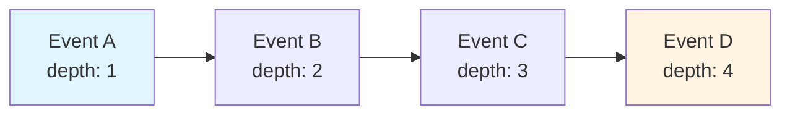

### Зачем это нужно?

#### 1. **Обеспечение порядка событий**

Без `prev_events` невозможно определить правильный порядок событий в распределенной системе. С `prev_events` каждое событие явно указывает, после каких событий оно должно идти.

**Пример:**
```
Пользователь A отправляет сообщение "Привет" → Event1
Пользователь B отправляет сообщение "Пока" → Event2
```

Если Event2 ссылается на Event1 в `prev_events`, то все серверы знают, что "Привет" должно идти перед "Пока", даже если Event2 пришел раньше Event1.

#### 2. **Разрешение конфликтов при одновременной отправке**

Когда два пользователя отправляют сообщения одновременно, возникает "fork" (вилка) в графе:

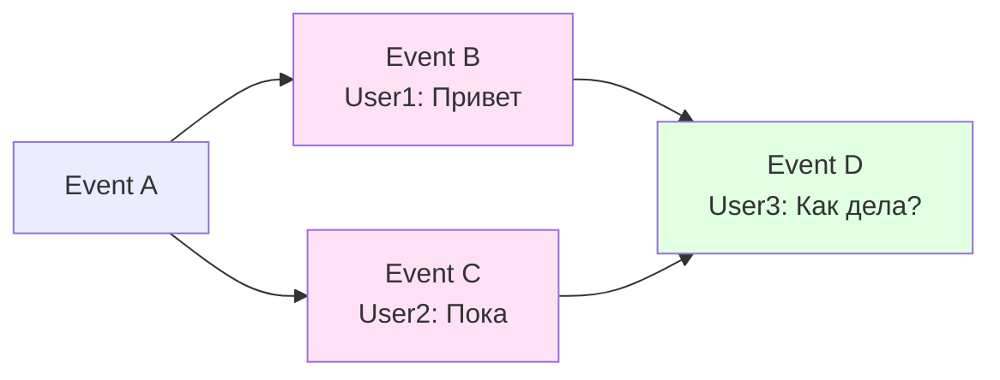

Event D ссылается на **оба** события (B и C) в `prev_events`, тем самым "сшивая" вилку и создавая единую историю.

#### 3. **Определение состояния комнаты**

Состояние комнаты вычисляется на основе последних state-событий в графе. `prev_events` позволяют определить, какое состояние было актуально на момент создания события.

#### 4. **Проверка консистентности**

Если событие ссылается на `prev_event`, которого нет в базе данных, это означает проблему — либо событие пришло раньше своих предшественников, либо есть пробел в истории. В этом случае сервер запрашивает недостающие события (backfill).

### Forward Extremities — что это?

**Forward Extremity** (передняя крайняя точка) — это событие, которое еще **не имеет следующих событий**. Это самые "свежие" события в комнате, которые еще не были использованы как `prev_events` для других событий.

**Пример:**
```
Комната имеет события: A → B → C → D
                              ↓
                             E
```

Здесь D и E — это forward extremities. Когда создается новое событие F, оно должно ссылаться на D и E в `prev_events`.

### Как это работает на практике?

#### Шаг 1: Получение forward extremities

Когда пользователь отправляет сообщение, Synapse запрашивает forward extremities комнаты:

```python
# synapse/storage/databases/main/event_federation.py
async def get_prev_events_for_room(self, room_id: str) -> List[str]:
    """
    Gets a subset of the current forward extremities in the given room.
    Limits the result to 10 extremities.
    """
    # Запрос к БД: SELECT event_id FROM event_forward_extremities
    # WHERE room_id = ? ORDER BY depth DESC LIMIT 10
```

**Ограничение до 10:** Если в комнате много одновременных сообщений, может быть много forward extremities. Чтобы не создавать события с сотнями `prev_events`, берется максимум 10 самых "глубоких" (с наибольшим depth).

#### Шаг 2: Создание события с prev_events

```python
# synapse/handlers/message.py
async def create_new_client_event(self, builder, ...):
    # Получаем forward extremities
    prev_event_ids = await self.store.get_prev_events_for_room(builder.room_id)
    
    # Создаем событие, ссылающееся на них
    event = await builder.build(
        prev_event_ids=prev_event_ids,  # ← вот они!
        auth_event_ids=auth_ids,
        depth=max(prev_events.depth) + 1  # depth = максимальная глубина prev + 1
    )
```

#### Шаг 3: Вычисление depth

`depth` — это число, показывающее "глубину" события в графе. Оно вычисляется как максимальный depth среди `prev_events` + 1.

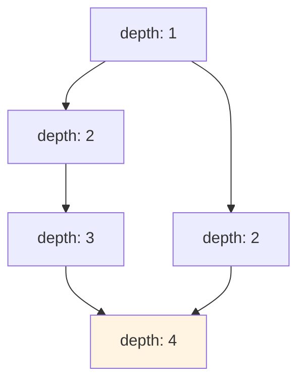

Event E имеет `prev_events = [C, D]`. Depth(E) = max(depth(C), depth(D)) + 1 = max(3, 2) + 1 = 4.

#### Шаг 4: Обновление forward extremities

После сохранения нового события, forward extremities обновляются:

```python
# synapse/storage/controllers/persist_events.py
async def _calculate_new_extremities(self, room_id, events, latest_event_ids):
    # Начинаем с существующих forward extremities
    result = set(latest_event_ids)
    
    # Добавляем новые события
    result.update(event.event_id for event in new_events)
    
    # Удаляем события, которые теперь являются prev_events новых событий
    result.difference_update(
        e_id for event in new_events for e_id in event.prev_event_ids()
    )
    
    return result
```

**Логика:** Если событие X было forward extremity, но теперь новое событие Y ссылается на X в `prev_events`, то X больше не является forward extremity. Y становится новой forward extremity.

### Визуальный пример полного цикла

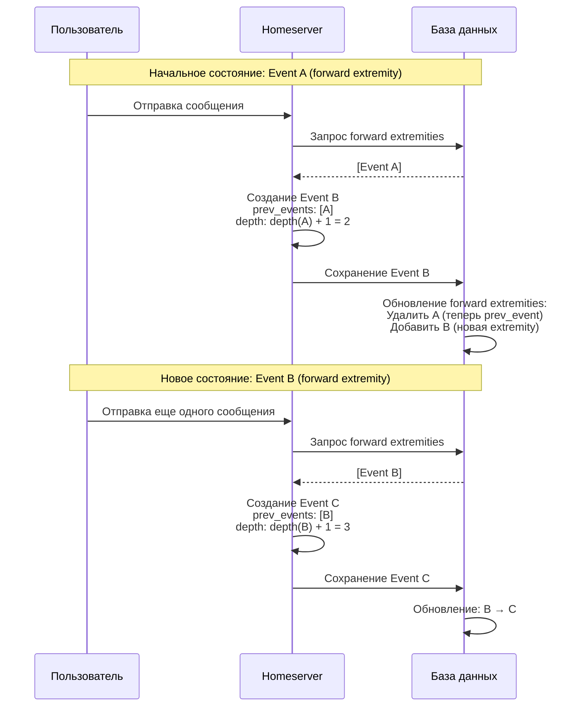

### Случай с конфликтом (одновременная отправка)

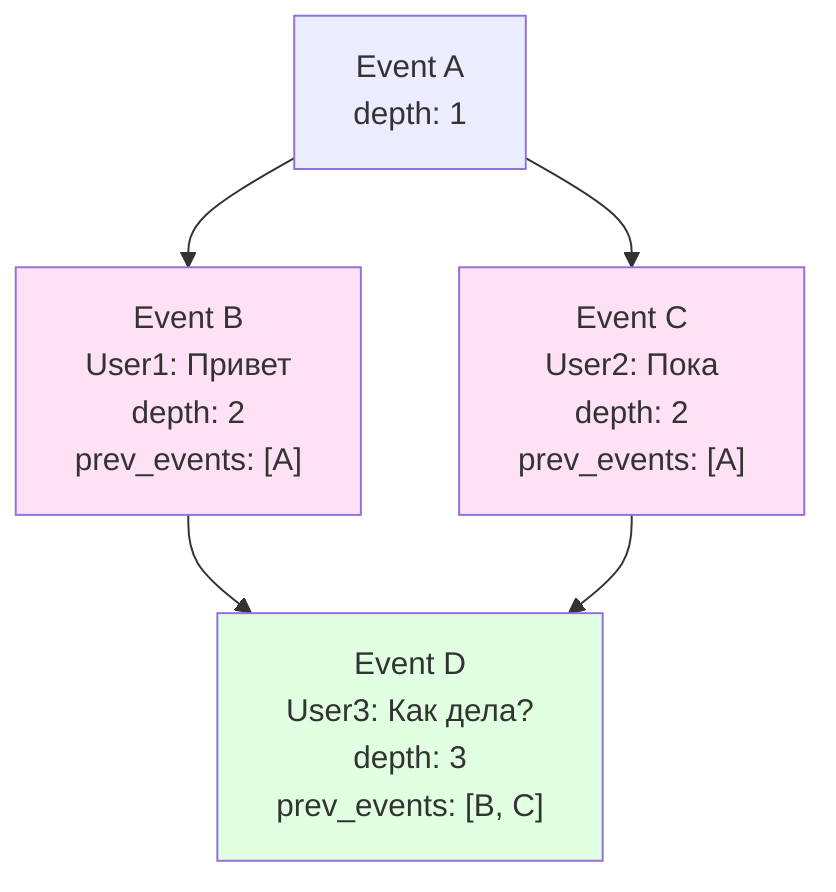

**Что произошло:**
1. User1 и User2 одновременно отправили сообщения
2. Оба события (B и C) ссылаются на A в `prev_events`
3. Оба имеют одинаковый depth = 2
4. Когда User3 отправляет сообщение, Event D ссылается на **оба** события (B и C)
5. Это "сшивает" вилку и создает единую историю

### Почему это важно для федерации?

В федеративной системе события могут приходить с разных серверов в разном порядке:

```
Сервер 1 получает: Event A, затем Event B
Сервер 2 получает: Event B, затем Event A
```

Без `prev_events` серверы могли бы показать события в разном порядке. С `prev_events`:
- Event B явно указывает, что A идет перед ним
- Сервер 2, получив B раньше A, знает, что нужно подождать A или запросить его (backfill)
- Оба сервера в итоге покажут события в одинаковом порядке

### Резюме

**`prev_events` — это механизм, который:**

1. ✅ **Обеспечивает порядок** — каждое событие явно указывает свои предшественники
2. ✅ **Разрешает конфликты** — одновременные события "сшиваются" через общие `prev_events`
3. ✅ **Определяет состояние** — позволяет вычислить состояние комнаты на момент события
4. ✅ **Обеспечивает консистентность** — помогает обнаружить пробелы в истории
5. ✅ **Работает в распределенной системе** — все серверы приходят к одинаковому порядку событий

**Forward Extremities** — это "кончики" графа, самые свежие события, которые используются как `prev_events` для следующих событий.

## Оптимизации и особенности

### State Groups

Вместо хранения полного состояния для каждого события, Synapse использует state groups — группы событий с одинаковым состоянием. Это значительно уменьшает объем хранимых данных.

### Backfill

Если сервер получает событие, ссылающееся на неизвестное prev_event, он запрашивает недостающие события у других серверов (backfill). Это гарантирует, что граф событий остается связным.

### Event DAG

События формируют Directed Acyclic Graph (DAG), где каждое событие ссылается на предыдущие через `prev_events`. Это обеспечивает:
- Порядок событий
- Консистентность
- Возможность разрешения конфликтов

### Auth Events

Auth events — это события, необходимые для проверки прав на создание нового события. Они включают:
- `m.room.create` — создание комнаты
- `m.room.member` — членство
- `m.room.power_levels` — права доступа
- И другие state events, влияющие на авторизацию

## Read Receipts и Read Markers: Механизм "прочитано/не прочитано"

### Введение

В Matrix есть два механизма для отслеживания прочтения сообщений:

1. **Read Receipts (m.read)** — публичные уведомления о том, что пользователь прочитал конкретное сообщение. Видны всем участникам комнаты.
2. **Read Markers (m.fully_read)** — приватные маркеры, показывающие, до какого события пользователь прочитал комнату. Видны только самому пользователю.

Также существует **m.read.private** — приватный read receipt, видимый только самому пользователю.

### Типы Receipts

```python
# synapse/api/constants.py
class ReceiptTypes:
    READ: Final = "m.read"              # Публичный read receipt
    READ_PRIVATE: Final = "m.read.private"  # Приватный read receipt
    FULLY_READ: Final = "m.fully_read"  # Read marker (всегда приватный)
```

**Разница между типами:**

| Тип | Видимость | Назначение | Хранение |
|-----|-----------|------------|----------|
| `m.read` | Публичный | Показывает, что пользователь прочитал конкретное сообщение | `receipts_linearized` |
| `m.read.private` | Приватный | То же, что `m.read`, но только для пользователя | `receipts_linearized` |
| `m.fully_read` | Приватный | Маркер "прочитано до этого события" | `account_data` |

### Архитектура Read Receipts

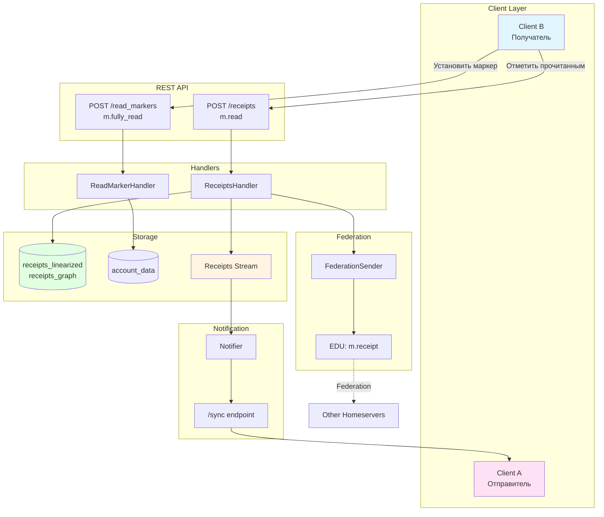

### Поток данных: Отправка Read Receipt

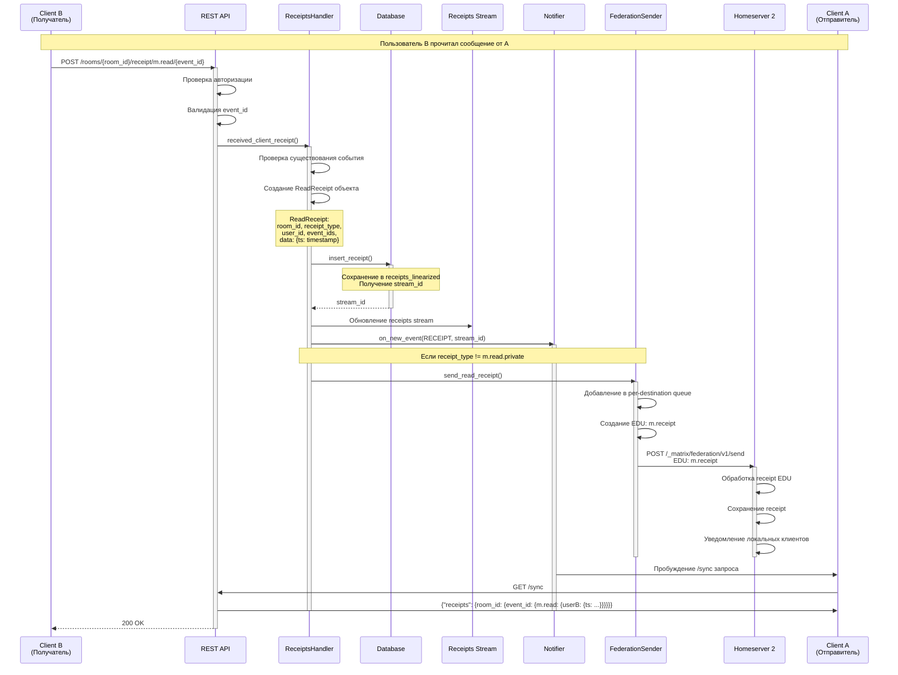

### Детальный процесс обработки Read Receipt

#### Шаг 1: Клиент отправляет receipt

```python
# Клиент отправляет POST запрос
POST /rooms/!room123/receipt/m.read/$event456
Content-Type: application/json

{
  "thread_id": null  # или ID треда, если receipt для треда
}
```

#### Шаг 2: Обработка в ReceiptsHandler

```python
# synapse/handlers/receipts.py
async def received_client_receipt(
    self, room_id, receipt_type, user_id, event_id, thread_id
):
    # Проверка существования события
    if not await self.event_handler.get_event(user_id, room_id, event_id):
        return
    
    # Создание ReadReceipt объекта
    receipt = ReadReceipt(
        room_id=room_id,
        receipt_type=receipt_type,  # "m.read" или "m.read.private"
        user_id=user_id.to_string(),
        event_ids=[event_id],
        thread_id=thread_id,
        data={"ts": int(self.clock.time_msec())}  # timestamp
    )
    
    # Сохранение и обработка
    is_new = await self._handle_new_receipts([receipt])
    
    # Отправка через federation (если не приватный)
    if self.federation_sender and receipt_type != ReceiptTypes.READ_PRIVATE:
        await self.federation_sender.send_read_receipt(receipt)
```

#### Шаг 3: Сохранение в базу данных

```python
# synapse/storage/databases/main/receipts.py
async def insert_receipt(
    self, room_id, receipt_type, user_id, event_ids, thread_id, data
):
    # Конвертация event_ids в linearized форму (если несколько)
    if len(event_ids) == 1:
        linearized_event_id = event_ids[0]
    else:
        # Конвертация графа в линейную форму
        linearized_event_id = await self._graph_to_linear(room_id, event_ids)
    
    # Получение нового stream_id
    async with self._receipts_id_gen.get_next() as stream_id:
        # Сохранение в receipts_linearized
        await self.db_pool.runInteraction(
            "insert_linearized_receipt",
            self._insert_linearized_receipt_txn,
            room_id, receipt_type, user_id,
            linearized_event_id, thread_id, data,
            stream_id=stream_id
        )
    
    return stream_id
```

**Структура таблицы `receipts_linearized`:**

```sql
CREATE TABLE receipts_linearized (
    stream_id BIGINT NOT NULL,
    room_id TEXT NOT NULL,
    receipt_type TEXT NOT NULL,  -- "m.read" или "m.read.private"
    user_id TEXT NOT NULL,
    event_id TEXT NOT NULL,
    thread_id TEXT,  -- NULL для main timeline
    data TEXT NOT NULL,  -- JSON: {"ts": timestamp}
    CONSTRAINT receipts_linearized_uniqueness UNIQUE 
        (room_id, receipt_type, user_id, thread_id)
);
```

**Важно:** Для каждой комбинации `(room_id, receipt_type, user_id, thread_id)` может быть только один receipt. Новый receipt заменяет старый.

#### Шаг 4: Уведомление через Receipts Stream

```python
# synapse/handlers/receipts.py
async def _handle_new_receipts(self, receipts):
    receipts_persisted = []
    for receipt in receipts:
        stream_id = await self.store.insert_receipt(...)
        if stream_id is None:  # Старый receipt
            continue
        receipts_persisted.append(receipt)
    
    if not receipts_persisted:
        return False
    
    max_batch_id = self.store.get_max_receipt_stream_id()
    affected_room_ids = list({r.room_id for r in receipts_persisted})
    
    # Уведомление через receipts stream
    self.notifier.on_new_event(
        StreamKeyType.RECEIPT, max_batch_id, rooms=affected_room_ids
    )
    
    # Уведомление pusher pool (для push-уведомлений)
    await self.hs.get_pusherpool().on_new_receipts(
        {r.user_id for r in receipts_persisted}
    )
    
    return True
```

#### Шаг 5: Отправка через Federation

```python
# synapse/federation/sender/per_destination_queue.py
def add_read_receipt_to_queue(self, receipt: ReadReceipt):
    # Сериализация receipt
    serialized_receipt = {
        "event_ids": receipt.event_ids,
        "data": receipt.data
    }
    if receipt.thread_id:
        serialized_receipt["data"]["thread_id"] = receipt.thread_id
    
    # Поиск подходящего EDU или создание нового
    for edu in self._pending_receipt_edus:
        receipt_content = edu.setdefault(receipt.room_id, {}).setdefault(
            receipt.receipt_type, {}
        )
        if receipt.user_id not in receipt_content:
            receipt_content[receipt.user_id] = serialized_receipt
            break
    else:
        # Создание нового EDU
        self._pending_receipt_edus.append({
            receipt.room_id: {
                receipt.receipt_type: {
                    receipt.user_id: serialized_receipt
                }
            }
        })
```

**Формат EDU для federation:**

```json
{
  "edu_type": "m.receipt",
  "content": {
    "!room123": {
      "m.read": {
        "@userB:server1.com": {
          "event_ids": ["$event456"],
          "data": {
            "ts": 1234567890,
            "thread_id": null
          }
        }
      }
    }
  }
}
```

### Read Markers (m.fully_read)

Read Marker — это приватный маркер, показывающий, до какого события пользователь прочитал комнату. В отличие от read receipts, он хранится в `account_data`, а не в `receipts_linearized`.

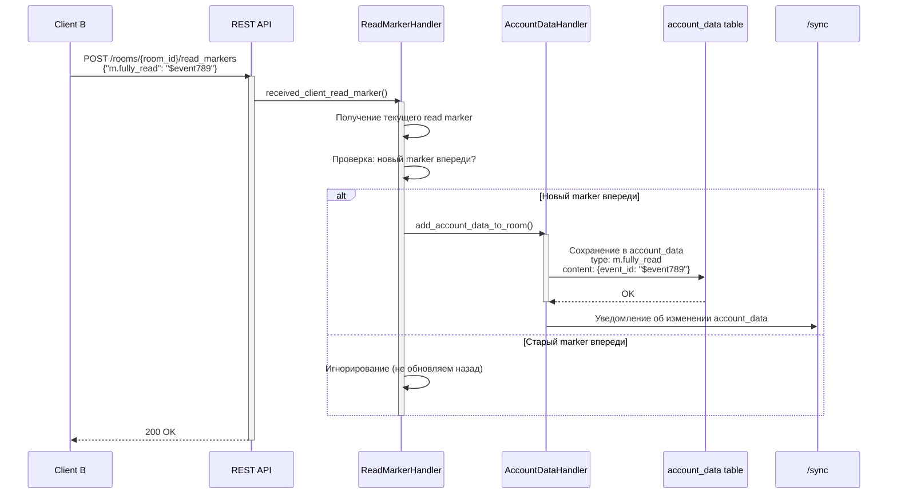

**Ключевые отличия Read Markers:**

1. **Хранение:** `account_data` вместо `receipts_linearized`
2. **Видимость:** Только самому пользователю (приватный)
3. **Назначение:** Показывает позицию "прочитано до", а не конкретное сообщение
4. **Обновление:** Обновляется только если новый marker впереди текущего

### Получение Receipts через /sync

Когда клиент делает `/sync` запрос, он получает новые receipts:

```python
# synapse/handlers/sync.py
async def _generate_sync_entry_for_rooms(...):
    # Получение receipts
    receipt_source = self.event_sources.sources.receipt
    receipts, receipt_key = await receipt_source.get_new_events(
        user=sync_config.user,
        from_key=receipt_key,  # Последний известный receipt stream token
        limit=sync_config.filter_collection.ephemeral_limit(),
        room_ids=room_ids,
    )
    
    # Фильтрация приватных receipts других пользователей
    receipts = ReceiptEventSource.filter_out_private_receipts(
        receipts, user.to_string()
    )
    
    # Добавление в ответ
    for event in receipts:
        room_id = event["room_id"]
        event_copy = {k: v for (k, v) in event.items() if k != "room_id"}
        ephemeral_by_room.setdefault(room_id, []).append(event_copy)
```

**Формат ответа /sync:**

```json
{
  "rooms": {
    "join": {
      "!room123": {
        "ephemeral": {
          "events": [
            {
              "type": "m.receipt",
              "content": {
                "$event456": {
                  "m.read": {
                    "@userB:server1.com": {
                      "ts": 1234567890
                    }
                  }
                }
              }
            }
          ]
        }
      }
    }
  }
}
```

### Визуализация полного потока

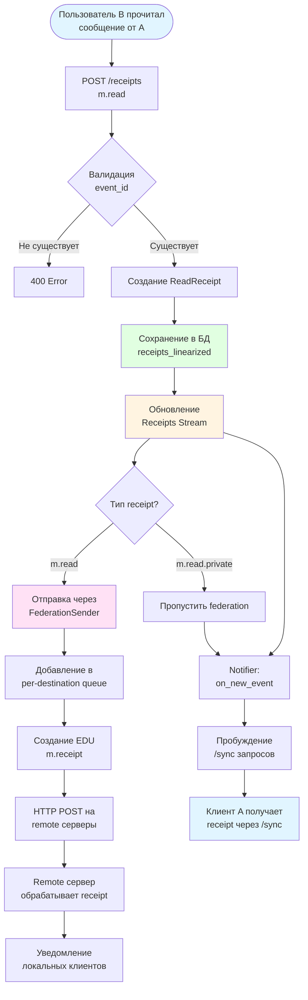

### Хранение в базе данных

#### Receipts (m.read, m.read.private)

**Таблица `receipts_linearized`:**
- `stream_id` — ID в receipts stream
- `room_id` — ID комнаты
- `receipt_type` — "m.read" или "m.read.private"
- `user_id` — ID пользователя
- `event_id` — ID события, которое прочитано
- `thread_id` — ID треда (NULL для main timeline)
- `data` — JSON с timestamp и другими данными

**Уникальность:** `(room_id, receipt_type, user_id, thread_id)` — только один receipt на комбинацию.

#### Read Markers (m.fully_read)

**Таблица `account_data`:**
- `user_id` — ID пользователя
- `room_id` — ID комнаты (NULL для глобального account_data)
- `account_data_type` — "m.fully_read"
- `content` — JSON: `{"event_id": "$event789"}`

### Поддержка Threads

Matrix поддерживает threads (ветки обсуждений). Receipts могут быть привязаны к конкретному thread:

```python
# Отправка receipt для треда
POST /rooms/!room123/receipt/m.read/$event456
{
  "thread_id": "$thread789"
}
```

В этом случае receipt сохраняется с `thread_id = "$thread789"` и применяется только к событиям в этом треде.

### Резюме

**Read Receipts (m.read):**
- ✅ Публичные уведомления о прочтении конкретного сообщения
- ✅ Хранятся в `receipts_linearized`
- ✅ Отправляются через federation (кроме `m.read.private`)
- ✅ Видны всем участникам комнаты
- ✅ Передаются через receipts stream в `/sync`

**Read Markers (m.fully_read):**
- ✅ Приватные маркеры позиции "прочитано до"
- ✅ Хранятся в `account_data`
- ✅ Видны только самому пользователю
- ✅ Обновляются только вперед (не назад)
- ✅ Передаются через account_data в `/sync`

**Ключевые особенности:**
1. Receipts заменяют предыдущие для той же комбинации `(room_id, receipt_type, user_id, thread_id)`
2. Приватные receipts (`m.read.private`) не отправляются через federation
3. Receipts stream позволяет клиентам получать обновления в реальном времени
4. Federation использует EDU для передачи receipts между серверами

## Заключение

Архитектура Synapse построена вокруг концепции событий (events), которые формируют неизменяемый граф (DAG) в каждой комнате. Процесс отправки сообщения включает:

1. Создание события с правильными ссылками на предыдущие события
2. Проверку авторизации
3. Сохранение в базу данных
4. Уведомление локальных клиентов
5. Отправку на другие homeservers через federation

Все компоненты работают асинхронно, что позволяет Synapse обрабатывать большое количество одновременных запросов. Использование workers позволяет масштабировать систему горизонтально, распределяя нагрузку между процессами.

Механизм read receipts обеспечивает обратную связь между пользователями, показывая, кто и когда прочитал сообщения, что критично для эффективной коммуникации в распределенной системе.
